# Gemini 워크플로우 - Q&A 시스템

[](https://github.com/hamtoy/Test/actions/workflows/ci.yaml)
[](https://codecov.io/gh/hamtoy/Test)

Google Gemini AI를 활용한 Q&A 응답 평가 및 재작성 워크플로우 시스템입니다.

## 🚀 빠른 시작 (5분)

### 1. 설치

```bash
# 기본 설치
pip install -e .

# RAG 기능 포함
pip install -e ".[rag]"

# 웹 UI 포함
pip install -e ".[web]"

# 전체 기능 설치
pip install -e ".[all]"
```

### 2. 환경 설정

```bash
cp .env.example .env
# .env 파일에서 GEMINI_API_KEY 설정
```

### 3. 실행

```bash
python -m src.main
```

### 메뉴 기능

#### 1. 질의 생성 및 평가 🔄

- OCR 파일 및 후보 답변 파일 선택
- 사용자 의도 입력 (선택사항)
- 전략적 질의 자동 생성
- 각 질의에 대한 평가 및 재작성 실행

**사용 방법:**

1. 메뉴에서 `1` 선택
2. OCR 파일명 입력 (기본: `input_ocr.txt`)
3. 후보 답변 파일명 입력 (기본: `input_candidates.json`)
4. 사용자 의도 입력 (선택)
5. 생성된 질의 확인 후 진행

#### 2. 검수 (질의/답변) ✅

- 질의 검수: 직접 입력 모드 지원
- 답변 검수: 외부 파일 기반 검수 지원

#### 3. 수정 (사용자 요청 기반 재작성) ✏️

- 사용자 요청에 따른 답변 재작성
- 기존 답변을 개선하거나 스타일 변경

#### 4. 캐시 통계 분석 📊

- 캐시 hit/miss 비율 확인
- 비용 절감 효과 분석
- 토큰 사용 통계

#### 5. 종료 🚪

시스템 종료

### 기능 플래그 자동 감지

시스템은 `.env` 파일에서 다음 기능들을 자동으로 감지하고 메뉴에 표시합니다:

- **Neo4j** (`NEO4J_URI`): 그래프 데이터베이스 연동
- **LATS** (`ENABLE_LATS=true`): 언어 에이전트 트리 탐색
- **Data2Neo** (`ENABLE_DATA2NEO=true`): 데이터-Neo4j 변환
- **Redis** (`REDIS_URL`): 캐시 서버 연동

## 데이터/산출물 위치

- Neo4j 임포트 CSV/스크립트: `data/neo4j/` (`guide.csv`, `qna.csv`, `import_*.cypher`, README 포함)
- 테스트/리포트 산출물: `artifacts/` (예: `verification_result.txt`, 커버리지 파일 등)

## 출력 및 로그

- 결과: `data/outputs/result_turn_<id>_<timestamp>.md`
- 콘솔: Rich 포맷 출력
- 로그 파일: `app.log`
- 캐싱: 프롬프트 토큰이 2048개 이상일 때만 활성화 (Gemini API 제약)
- **캐시 통계**: `cache_stats.jsonl`(기본)로 누적 저장
  - 파일 경로: `CACHE_STATS_FILE` 환경 변수로 변경 가능
  - 보존 개수: `CACHE_STATS_MAX_ENTRIES`로 조정 가능
  - 통계 확인: `python -m src.main --analyze-cache`
- 로그 분리: INFO+ → `app.log`, ERROR+ → `error.log` (JSON 포맷은 production 모드에서 자동 적용)
- 체크포인트: `--resume` 사용 시 `checkpoint.jsonl`(기본)에서 완료된 질의를 건너뜀. `--checkpoint-file`로 경로 지정 가능
- **프로파일링 결과**: `profiling_results/` 디렉토리에 `.prof` 파일 저장

## 💾 캐싱 전략

### Context Caching 작동 방식

시스템은 **2048 토큰 이상**의 프롬프트를 자동으로 캐싱합니다.

```text
프롬프트 크기           처리 방식              비용
─────────────────────────────────────────────────
< 2,048 토큰    →    일반 API            일반 가격
≥ 2,048 토큰    →    Context Caching     50-90% 절감
```

#### 왜 2048인가?

- Gemini API의 기술적 제약사항 (변경 불가)
- 작은 컨텍스트는 캐싱 오버헤드가 더 큼
- 2048 이상에서 비용 절감 효과가 명확함

#### 자동 처리

- 시스템이 자동으로 판단하여 처리
- 사용자가 신경 쓸 필요 없음
- 로그에서 캐싱 여부 확인 가능

자세한 내용은 [캐싱 가이드](docs/CACHING.md)를 참조하세요.

### 🔍 LATS (Language Agent Tree Search)

고품질 답변 생성을 위한 트리 기반 탐색 기능입니다:

```bash
# LATS 활성화 (.env)
ENABLE_LATS=true
```

자세한 설정 및 사용법은 [LATS 가이드](docs/LATS_GUIDE.md)를 참조하세요.

## 성능 분석 개요

### API Latency 통계

로그 파일에서 API 호출 레이턴시를 분석하여 백분위수 통계를 확인할 수 있습니다:

```bash
# 기본 로그 파일 분석 (app.log)
python scripts/latency_baseline.py

# 사용자 지정 로그 파일
python scripts/latency_baseline.py --log-file custom.log

# 여러 로그 파일 통합 분석
python scripts/latency_baseline.py --log-file run1.log --log-file run2.log
```

출력 예시:

```text
┏━━━━━━━━┳━━━━━━━━┓
┃ Metric ┃ Value  ┃
┡━━━━━━━━╇━━━━━━━━┩
│ Count  │ 150    │
│ Min    │ 45.23  │
│ Mean   │ 234.56 │
│ Max    │ 892.10 │
│ p50    │ 210.34 │
│ p90    │ 356.78 │
│ p99    │ 678.90 │
└────────┴────────┘
```text

## 개발 도구

### 성능 분석

- **레이턴시 분석**: `python scripts/latency_baseline.py --log-file app.log`
  - API 호출 레이턴시 통계 (p50/p90/p99)

### 결과 분석

- **캐시 분석**: `python -m src.main --analyze-cache`
  - 캐시 hit/miss, 비용 절감 계산

### 데이터 관리

- **백업**: `pwsh scripts/dev/backup.ps1`
  - 데이터·로그를 날짜별 ZIP으로 압축
  - 기본값: `.env` 포함
  - 민감정보 제외: `-SkipEnv` 옵션 사용

## 출력 예시

```text
INFO     리소스 로드 중...
INFO     Rate limiter enabled: 60 requests/minute
INFO     워크플로우 시작 (Mode: AUTO)
INFO     질의 생성 중...
INFO     Token Usage - Prompt: 3,095, Response: 45, Total: 4,929
INFO     질의 생성 완료...
INFO     후보 평가 중...
INFO     Token Usage - Prompt: 4,908, Response: 282, Total: 7,123
INFO     후보 선정 완료: A
INFO     답변 재작성 중...
INFO     Token Usage - Prompt: 3,681, Response: 867, Total: 6,316

🤖 Query: 핵심 내용 요약
📊 Selected Candidate: A

╭─ 📝 Final Output ──────────────────────────╮
│ # 요약                                     │
│                                            │
│ 주요 내용:                                 │
│ 1. 첫 번째 요점                            │
│ 2. 두 번째 요점                            │
╰────────────────────────────────────────────╯

╭─ 비용 요약 ───────────────────────────────╮
│ 💰 총 비용: $0.0534 USD                   │
│ 📊 토큰: 11,684 입력 / 1,194 출력         │
│ 📈 캐시: 5 hit / 2 miss                   │
╰────────────────────────────────────────────╯
```text

## 테스트

```bash
# 전체 테스트
pytest tests/ -v

# 특정 테스트
pytest tests/test_agent.py -v

# 커버리지 포함
pytest tests/ --cov=src --cov-report=html

# 빠른 피드백 루프
uv run pytest-watcher .
uv run python -m pytest -n auto --ff tests/
```

## 개발 가이드

### 주요 모듈

> **참고**: v3.0부터 새로운 패키지 기반 아키텍처를 사용합니다. 자세한 내용은 [BREAKING_CHANGES_v3.md](docs/BREAKING_CHANGES_v3.md)를 참조하세요.

- `src/agent/`: Gemini API 호출, 재시도, rate limiting, 비용 추적
  - `core.py`: GeminiAgent 핵심 클래스
  - `cost_tracker.py`: 비용 추적 및 예산 관리
  - `rate_limiter.py`: API 호출 제한 관리
  - `batch_processor.py`: 배치 처리 시스템
- `src/caching/`: 캐싱 인프라
  - `analytics.py`: 캐시 통계 분석 및 비용 절감 계산
  - `layer.py`: 캐싱 레이어 추상화
  - `redis_cache.py`: Redis 기반 캐시
- `src/config/`: 환경 변수 기반 설정 관리
  - `settings.py`: AppConfig 설정 클래스
  - `constants.py`: 가격 티어, 예산 임계값, UI 메시지 템플릿
  - `exceptions.py`: 사용자 정의 예외 (API 제한, 예산 초과 등)
- `src/core/`: 핵심 모델 및 인터페이스
  - `models.py`: 환각 감지 기능이 포함된 Pydantic 모델
  - `schemas.py`: 데이터 스키마 정의
- `src/infra/`: 인프라 유틸리티
  - `logging.py`: 콘솔/파일 로깅 분리, 민감 데이터 마스킹
  - `utils.py`: 파일 처리 및 파싱 유틸리티
  - `neo4j.py`: Neo4j 연결 관리
- `src/processing/`: 데이터 처리
  - `loader.py`: 타입 검증을 포함한 데이터 로딩
- `src/qa/`: Q&A 시스템 컴포넌트
  - `rag_system.py`: RAG 및 그래프 기반 QA 시스템
  - `quality.py`: 통합 품질 관리 파이프라인
  - `pipeline.py`: 통합 QA 파이프라인
- `src/workflow/`: 워크플로우 오케스트레이션
  - `executor.py`: 워크플로우 실행
- `src/main.py`: 메인 진입점 및 인터랙티브 메뉴 시작

### 주요 기능

#### 환각 감지

LLM이 선택한 후보가 실제 점수와 일치하는지 검증:

```python
@model_validator(mode='after')
def validate_best_candidate(self):
    actual_best = max(self.evaluations, key=lambda x: x.score)
    if self.best_candidate != actual_best.candidate_id:
        logger.warning("LLM Hallucination Detected - Auto-correcting")
        self.best_candidate = actual_best.candidate_id
```

#### Rate Limiting

- **Semaphore**: 동시 API 호출 수 제한
- **Rate Limiter**: 분당 요청 수 제한
- `429 Too Many Requests` 오류 방지

#### Dependency Injection

테스트와 프로덕션 환경 분리:

```python
# 프로덕션
agent = GeminiAgent(config, jinja_env=real_env)

# 테스트
agent = GeminiAgent(config, jinja_env=mock_env)
```

#### 병렬 처리

여러 질의를 동시에 처리하여 성능 향상:

```python
# asyncio.gather를 사용한 병렬 쿼리 처리
results = await asyncio.gather(*[
    process_single_query(agent, query, ocr_text, candidates)
    for query in queries
])
```

## 환경 변수

| 변수                       | 기본값                 | 설명               |
| -------------------------- | ---------------------- | ------------------ |
| `GEMINI_API_KEY`           | 필수                   | Gemini API 키      |
| `GEMINI_MODEL_NAME`        | `gemini-flash-latest`  | 사용할 모델        |
| `GEMINI_MAX_OUTPUT_TOKENS` | `4096`                 | 최대 출력 토큰 수  |
| `GEMINI_MAX_OUTPUT_TOKENS_EXPLANATION` | (옵션) | explanation 토큰 상한 override |
| `GEMINI_MAX_OUTPUT_TOKENS_REASONING` | (옵션) | reasoning 토큰 상한 override |
| `GEMINI_MAX_OUTPUT_TOKENS_TARGET` | (옵션) | target 토큰 상한 override |
| `GEMINI_TIMEOUT`           | `120`                  | API 타임아웃 (초)  |
| `GEMINI_MAX_CONCURRENCY`   | `10`                   | 최대 동시 요청 수  |
| `GEMINI_TEMPERATURE`       | `0.2`                  | 샘플링 온도        |
| `GEMINI_CACHE_SIZE`        | `50`                   | 컨텍스트 캐시 크기 |
| `GEMINI_CACHE_TTL_MINUTES` | `360`                  | 캐시 TTL (분)      |
| `LOG_LEVEL`                | `INFO`                 | 로그 레벨          |
| `CACHE_STATS_FILE`         | `cache_stats.jsonl`    | 캐시/토큰 통계 파일 경로 |
| `CACHE_STATS_MAX_ENTRIES`  | `100`                  | 통계 파일 보존 개수 |
| `LOCAL_CACHE_DIR`          | `.cache`               | 로컬 캐시 메타 저장 폴더 |
| `LOG_FILE`                 | `app.log`              | INFO+ 로그 파일 경로 |
| `ERROR_LOG_FILE`           | `error.log`            | ERROR+ 로그 파일 경로 |
| `PROJECT_ROOT`             | 자동 감지              | 프로젝트 루트 경로 |
| `NEO4J_URI`                | `bolt://localhost:7687`| Neo4j 접속 URI     |
| `NEO4J_USER`               | `neo4j`                | Neo4j 사용자명     |
| `NEO4J_PASSWORD`           | 필수                   | Neo4j 비밀번호     |

자동 감지는 `.git`, `templates`, `data` 폴더를 기준으로 수행됩니다.

## FAQ

- **GEMINI_API_KEY 형식 오류가 뜹니다.** → `AIza`로 시작하고 총 39자여야 합니다. `.env`에서 공백/따옴표가 섞여 있지 않은지 확인하세요.
- **커버리지 기준은 얼마인가요?** → CI에서 `--cov-fail-under=80`을 사용합니다. 로컬에서도 동일하게 실행됩니다.
- **캐시 통계 파일은 어디에 저장되나요?** → 기본 `cache_stats.jsonl`이며, `CACHE_STATS_FILE`로 경로를, `CACHE_STATS_MAX_ENTRIES`로 보존 개수를 설정할 수 있습니다.

## 구현된 기능

- **타입 안정성**: Pydantic Literal 사용, mypy strict mode 통과 (v3.0)
- **패키지 아키텍처**: 14개의 모듈화된 패키지 구조 (v3.0)
- **예외 처리**: 다중 레이어 에러 핸들링
- **Rate Limiting**: 동시성 및 RPM 제어
- **비용 추적**: 실시간 토큰 사용량 계산
- **로깅**: 콘솔 및 파일 분리, API 키 마스킹
- **테스트**: Dependency Injection 지원, 100% 테스트 통과 (v3.0)
- **검증**: 입력 유효성 검사 및 환각 감지
- **병렬 처리**: 여러 쿼리 동시 처리
- **캐시 모니터링**: 캐시 hit/miss 추적
- **배치 처리**: BatchProcessor를 통한 대량 요청 처리 (v3.0)

## 문서

- **[UV_GUIDE.md](UV_GUIDE.md)**: UV 패키지 매니저 사용 가이드
- **[CONTRIBUTING.md](CONTRIBUTING.md)**: 기여 가이드라인
- **[DEPLOYMENT_VERIFIED.md](DEPLOYMENT_VERIFIED.md)**: 배포 검증 내역
- **[ARCHITECTURE.md](docs/ARCHITECTURE.md)**: 시스템 아키텍처
- **[API.md](docs/API.md)**: API 레퍼런스
- **[user_manual.md](docs/user_manual.md)**: 사용자 매뉴얼 (설치, 설정, 트러블슈팅)
- **[DEPRECATION.md](DEPRECATION.md)**: Deprecation 정책 및 일정
- **[MIGRATION.md](MIGRATION.md)**: v3.0 마이그레이션 가이드
- **[BREAKING_CHANGES_v3.md](docs/BREAKING_CHANGES_v3.md)**: v3.0 주요 변경 사항
- **Sphinx 문서**: `docs/` 디렉토리에서 `make html` 실행

## 즉시 실행 가능 - QA 시스템 구축

### 1. 그래프 스키마 구축

```bash
python -m src.graph.builder
```

Notion 가이드에서 Rule/Constraint/Example을 추출하여 Neo4j 지식 그래프를 생성합니다.

### 2. Neo4j Browser에서 확인

```cypher
MATCH (n) RETURN labels(n), count(n)
```

생성된 노드 타입별 개수를 확인합니다.

### 3. RAG 시스템 테스트

```bash
python -m src.qa.rag_system
```

벡터 검색 기반 규칙 조회 및 제약 조건/모범 사례를 확인합니다.

### 4. 통합 파이프라인 실행

```bash
python -m src.main --integrated-pipeline --pipeline-meta examples/session_input.json
```

전체 QA 세션 생성 및 검증을 실행합니다.

---

## 📦 설치 옵션

| 설치 명령 | 포함 기능 |
|-----------|-----------|
| `pip install -e .` | 핵심 기능 (Gemini API, 캐싱, 비용 추적) |
| `pip install -e ".[rag]"` | + Neo4j RAG, LangChain |
| `pip install -e ".[web]"` | + FastAPI 웹 UI |
| `pip install -e ".[worker]"` | + Redis 워커 (LATS) |
| `pip install -e ".[multimodal]"` | + 이미지 처리 |
| `pip install -e ".[all]"` | 전체 기능 |
| `pip install -e ".[dev]"` | 개발/테스트 도구 |

---

## ✨ 핵심 기능

- 🤖 **질의 생성**: OCR 텍스트에서 질의 자동생성
- 📊 **후보 평가**: 여러 답변 후보 평가 및 점수 부여
- ✍️ **답변 재작성**: 선택된 답변의 품질 개선
- 💰 **비용 추적**: BudgetTracker로 토큰/비용 집계 및 한도 경고
- 🛡️ **안정성**: Rate limiting, 타입 검증, 환각 감지
- 🌳 **LATS 워커**: 경량 트리 탐색으로 액션 제안/검증/평가 (선택)
- 📈 **캐싱**: 2048 토큰 이상 프롬프트 자동 캐싱

---

## 🔗 상세 문서

| 문서 | 설명 |
|------|------|
| [📖 시작 가이드](docs/GETTING_STARTED.md) | 초보자를 위한 단계별 튜토리얼 |
| [⚙️ 설정 가이드](docs/CONFIGURATION.md) | 모든 환경 변수 및 설정 옵션 |
| [🚀 고급 기능](docs/ADVANCED_FEATURES.md) | LATS, RAG, 멀티모달 상세 가이드 |
| [💾 캐싱 전략](docs/CACHING.md) | 2048 토큰, TTL 전략, 비용 분석 |
| [❓ 문제 해결](docs/TROUBLESHOOTING.md) | FAQ 및 일반적인 문제 해결 방법 |
| [📊 모니터링](docs/MONITORING.md) | 메트릭, SLO, 알림 설정 |
| [🔒 보안](docs/SECURITY.md) | API 키 관리 및 보안 가이드 |
| [🏗️ 아키텍처](docs/ARCHITECTURE.md) | 시스템 아키텍처 상세 |
| [📚 전체 문서](docs/README_FULL.md) | 상세 문서 전체 |

---

## 🐳 Docker 실행

```bash
# 개발 환경
docker-compose up -d

# 프로덕션
docker pull ghcr.io/hamtoy/test:latest
docker run -d -e GEMINI_API_KEY=your_key -p 8000:8000 ghcr.io/hamtoy/test:latest
```

---

## 📊 시스템 개요

```mermaid
flowchart LR
    A[OCR 입력] --> B[질의 생성]
    B --> C[후보 평가]
    C --> D[답변 재작성]
    D --> E[결과 출력]

    C -.->|옵션: QA RAG| F[Neo4j 그래프]
    
    style F fill:#2d3748,stroke:#718096,stroke-dasharray: 5 5
```



> **기본 워크플로우** (실선): OCR 입력 → 질의 생성 → 후보 평가 → 답변 재작성 → 결과 출력  
> **선택적 RAG** (점선): Neo4j 그래프/벡터 검색을 통해 평가 품질 보강

---

## 📝 라이선스

MIT License

## 참고 라이브러리

- [Google Gemini AI](https://ai.google.dev/)
- [Pydantic](https://docs.pydantic.dev/)
- [Rich](https://rich.readthedocs.io/)
- [Tenacity](https://tenacity.readthedocs.io/)
