[](https://github.com/hamtoy/Test/actions/workflows/ci.yml)
[](https://codecov.io/gh/hamtoy/Test)

# Gemini 워크플로우 - Q&A 시스템

Google Gemini AI를 활용한 Q&A 응답 평가 및 재작성 워크플로우 시스템입니다.

## 🚀 빠른 시작 (5분)

### 1. 설치

```bash
# 기본 설치
pip install -e .

# RAG 기능 포함
pip install -e ".[rag]"

# 웹 UI 포함
pip install -e ".[web]"

# 전체 기능 설치
pip install -e ".[all]"
```

### 2. 환경 설정

```bash
cp .env.example .env
# .env 파일에서 GEMINI_API_KEY 설정
```

### 3. 실행

```bash
python -m src.main
```

---

## 📦 설치 옵션

| 설치 명령 | 포함 기능 |
|-----------|-----------|
| `pip install -e .` | 핵심 기능 (Gemini API, 캐싱, 비용 추적) |
| `pip install -e ".[rag]"` | + Neo4j RAG, LangChain |
| `pip install -e ".[web]"` | + FastAPI 웹 UI |
| `pip install -e ".[worker]"` | + Redis 워커 (LATS) |
| `pip install -e ".[multimodal]"` | + 이미지 처리 |
| `pip install -e ".[all]"` | 전체 기능 |
| `pip install -e ".[dev]"` | 개발/테스트 도구 |

---

## ✨ 핵심 기능

- 🤖 **질의 생성**: OCR 텍스트에서 질의 자동생성
- 📊 **후보 평가**: 여러 답변 후보 평가 및 점수 부여
- ✍️ **답변 재작성**: 선택된 답변의 품질 개선
- 💰 **비용 추적**: BudgetTracker로 토큰/비용 집계 및 한도 경고
- 🛡️ **안정성**: Rate limiting, 타입 검증, 환각 감지
- 🌳 **LATS 워커**: 경량 트리 탐색으로 액션 제안/검증/평가 (선택)
- 📈 **캐싱**: 2048 토큰 이상 프롬프트 자동 캐싱

---

## 🔗 상세 문서

| 문서 | 설명 |
|------|------|
| [📖 시작 가이드](docs/GETTING_STARTED.md) | 초보자를 위한 단계별 튜토리얼 |
| [⚙️ 설정 가이드](docs/CONFIGURATION.md) | 모든 환경 변수 및 설정 옵션 |
| [🚀 고급 기능](docs/ADVANCED_FEATURES.md) | LATS, RAG, 멀티모달 상세 가이드 |
| [💾 캐싱 전략](docs/CACHING.md) | 2048 토큰, TTL 전략, 비용 분석 |
| [❓ 문제 해결](docs/TROUBLESHOOTING.md) | FAQ 및 일반적인 문제 해결 방법 |
| [📊 모니터링](docs/MONITORING.md) | 메트릭, SLO, 알림 설정 |
| [🔒 보안](docs/SECURITY.md) | API 키 관리 및 보안 가이드 |
| [🏗️ 아키텍처](docs/ARCHITECTURE.md) | 시스템 아키텍처 상세 |
| [📚 전체 문서](docs/README_FULL.md) | 상세 문서 전체 |

---

## 🐳 Docker 실행

```bash
# 개발 환경
docker-compose up -d

# 프로덕션
docker pull ghcr.io/hamtoy/test:latest
docker run -d -e GEMINI_API_KEY=your_key -p 8000:8000 ghcr.io/hamtoy/test:latest
```

---

## 📊 시스템 개요

```mermaid
flowchart LR
    A[OCR 입력] --> B[질의 생성]
    B --> C[후보 평가]
    C --> D[답변 재작성]
    D --> E[결과 출력]

    C -.->|옵션: QA RAG| F[Neo4j 그래프]
    
    style F fill:#2d3748,stroke:#718096,stroke-dasharray: 5 5
```



> **기본 워크플로우** (실선): OCR 입력 → 질의 생성 → 후보 평가 → 답변 재작성 → 결과 출력  
> **선택적 RAG** (점선): Neo4j 그래프/벡터 검색을 통해 평가 품질 보강

---

## 📝 라이선스

MIT License

## 참고 라이브러리

- [Google Gemini AI](https://ai.google.dev/)
- [Pydantic](https://docs.pydantic.dev/)
- [Rich](https://rich.readthedocs.io/)
- [Tenacity](https://tenacity.readthedocs.io/)
