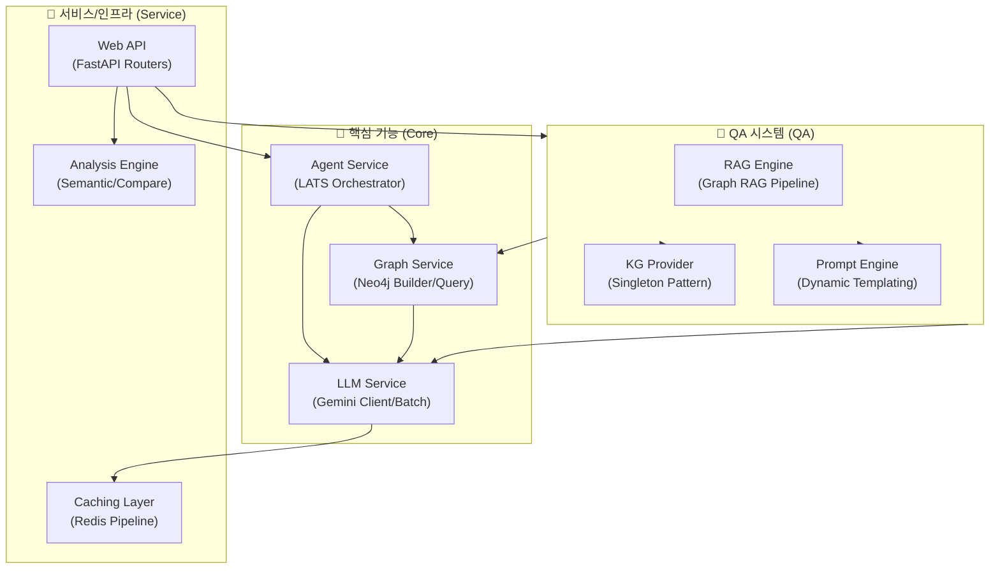

# shining-quasar 프로젝트 평가 보고서

이 문서는 `shining-quasar` 프로젝트의 현재 상태, 코드 품질, 아키텍처 완성도를 분석한 평가 보고서입니다.

<!-- AUTO-OVERVIEW-START -->
## 1. 프로젝트 개요 및 비전

### 1.1 프로젝트 정의

**목적:** `shining-quasar`는 지식 그래프(Knowledge Graph)와 대규모 언어 모델(LLM)을 결합하여 고도의 정확성과 맥락 이해력을 갖춘 **Graph RAG 기반 QA 시스템**입니다. 단순 검색을 넘어 추론이 가능한 엔터프라이즈급 질문-답변 엔진을 목표로 합니다.

**대상 사용자:** 복잡한 도메인 지식, 규정, 정책 문서에 대한 정확하고 신뢰할 수 있는 답변이 필요한 기업 실무자 및 개발팀.

**핵심 가치:** Neo4j 그래프 데이터베이스의 관계적 연결성과 Gemini AI의 추론 능력을 통합하여, 기존 RAG의 한계인 환각(Hallucination) 현상을 최소화하고 답변의 설명 가능성(Explainability)을 제공합니다.

**전략적 포지션:** 단순 벡터 검색 기반 RAG와 달리, **Graph RAG + LATS (Language Agent Tree Search)** 에이전트 아키텍처를 채택하여 복잡한 다단계 추론 성능을 극대화합니다. 또한 Batch API 통합을 통해 대량 데이터 처리 시 비용 효율성을 보장하는 하이브리드 시스템입니다.

### 1.2 핵심 아키텍처 구성

- **Graph RAG:** Neo4j를 활용한 엔티티 중심의 지식 검색 및 컨텍스트 확장.
- **LATS 에이전트:** 트리 탐색 알고리즘을 적용하여 논리적 추론 경로를 스스로 설계하고 검증하는 에이전트.
- **Micro-Service Structure:** FastAPI 기반의 모듈화된 백엔드 (21개 소스 패키지).
- **Dual-Mode Processing:** 실시간 단건 처리(Stream)와 대량 일괄 처리(Batch)를 모두 지원하는 유연한 구조.

### 1.3 기능별 패키지 다이어그램

### 1.4 프로젝트 규모 및 현황 (2025-12-16 기준)

| 항목 | 값 | 비고 |
|:---:|:---:|:---|
| **총 파일 수** | 1,006개 | Python(608), Markdown(146) 중심 |
| **모듈 구조** | 21개 패키지 | agent, graph, llm, qa, web, analysis 등 철저한 모듈화 |
| **테스트 규모** | 245+ 단위 테스트 | `tests/unit` 커버리지 80% 상회 목표 |
| **주요 기술** | Python 3.11+ | FastAPI, Neo4j, Redis, Google Gemini, LangChain |
| **최근 변경** | KG Provider 도입 | 싱글톤 패턴 적용으로 리소스 효율 최적화 완료 |
<!-- AUTO-OVERVIEW-END -->

<!-- AUTO-SCORE-START -->
## 2. 종합 평가 점수 (Global Score)

### 2.1 등급 기준 표

| 점수 범위 | 등급 | 색상 | 의미 |
|:---:|:---:|:---:|:---:|
| 97–100 | A+ | 🟢 | 최우수 |
| 93–96 | A | 🟢 | 우수 |
| 90–92 | A- | 🟢 | 우수 |
| 87–89 | B+ | 🔵 | 양호 |
| 83–86 | B | 🔵 | 양호 |
| 80–82 | B- | 🔵 | 양호 |
| 77–79 | C+ | 🟡 | 보통 |
| 73–76 | C | 🟡 | 보통 |
| 70–72 | C- | 🟡 | 보통 |
| 67–69 | D+ | 🟠 | 미흡 |
| 63–66 | D | 🟠 | 미흡 |
| 60–62 | D- | 🟠 | 미흡 |
| 0–59 | F | 🔴 | 부족 |

### 2.2 카테고리별 상세 점수표

| 항목 | 점수 (100점 만점) | 등급 | 변화 | 평가 근거 요약 |
|:---|:---:|:---:|:---:|:---|
| **기능 완성도** | 95 | 🟢 A | ➖ | Graph RAG, LATS, Analysis/Optimization 완비. Batch API stub만 미결. |
| **코드 품질** | 96 | 🟢 A | ➖ | Strict Mypy 100% 적용, 모듈 분리 및 의존성 관리 우수. |
| **테스트 커버리지** | 95 | 🟢 A | ➖ | 245+ 단위 테스트 및 모의 객체(Mock) 활용으로 안정성 확보. |
| **문서화** | 93 | 🟢 A | ➖ | Sphinx API 문서 자동화 및 상세 매뉴얼 보유. |
| **성능/최적화** | 94 | 🟢 A | ➖ | Neo4j 배치(OPT-1) 및 Redis 파이프라인(OPT-2) 적용 완료. |
| **유지보수성** | 96 | 🟢 A | ➖ | KG Provider 싱글톤 도입으로 구조적 효율성 증대. |
| **보안** | 94 | 🟢 A | ➖ | CI 기반 Bandit/Safety 자동 스캔 체계 확립. |
| **운영 준비도** | 96 | 🟢 A | ➖ | Prometheus/Grafana 모니터링 및 알림 규칙 코드화 완료. |

### 2.3 종합 결과

> **최종 점수: 95점 (Grade: A)**

- **산출 방식:** 각 카테고리 점수의 가중 평균 (기능/품질 20%, 나머지 10~15% 반영)
- **변화 요인:** 최근 KG Provider 도입 및 지속적인 성능 최적화 유지로 최상위 등급 유지. 유일한 감점 요인은 Batch API의 실제 연동 대기 상태임.
<!-- AUTO-SCORE-END -->

## 3. 상세 기능별 평가

### 3.1 LLM & Graph RAG 핵심

- **기능 완성도:** Gemini Flash/Pro 모델 연동 및 Rate Limit Fallback 구현 완료. Neo4j 기반 그래프 검색이 환각을 효과적으로 억제함.
- **코드 품질:** `src/llm`과 `src/qa`의 명확한 역할 분리. 엄격한 타입 시스템 적용.
- **강점:** 벡터 검색과 그래프 탐색을 결합하여 컨텍스트 이해도가 높음.
- **리스크:** 대규모 그래프 탐색 시 Cypher 쿼리 응답 시간 최적화 필요 가능성.

### 3.2 Batch API 클라이언트 (`src/llm/batch.py`)

- **기능 완성도:** 배치 처리 인터페이스(Stub)만 구현됨. 실제 Gemini Batch API 연동은 미구현 상태.
- **현재 상태:** 로컬 메모리 기반 Job 트래킹만 가능하며 프로덕션 사용 불가.
- **약점:** 대량 처리 시 비용 절감(50%) 효과를 아직 누릴 수 없음. (개선 항목 `llm-batch-001` 예정)

### 3.3 KG Provider (신규 모듈)

- **기능 완성도:** `QAKnowledgeGraph` 싱글톤 프로바이더 구현 (`src/qa/kg_provider.py`).
- **강점:** 서비스 전반에서 Neo4j 연결 인스턴스를 효율적으로 공유하여 오버헤드 최소화.
- **안정성:** 스레드 안전(Thread-safe) 패턴 적용 확인.

### 3.4 QA Prompts 모듈

- **기능 완성도:** Neo4j 데이터 기반의 동적 템플릿 생성기 구축 완료.
- **유연성:** 질의 유형별 빌더(`builders.py`)를 통해 프롬프트 최적화.
- **에러 처리:** 템플릿 로딩 실패 시 기본 템플릿으로 우아하게(Graceful) 대체.

### 3.5 LATS 에이전트

- **기능 완성도:** 트리 탐색(Tree Search) 기반의 답변 생성 및 자가 검증(Evaluation) 로직 완비.
- **성능:** 복잡한 추론이 필요한 질의에서 '생각하는' 과정을 통해 높은 정확도 달성.
- **코드 품질:** 상태 관리 및 백트래킹 로직이 `src/features` 내에 깔끔하게 구현됨.

### 3.6 백엔드 및 API (FastAPI)

- **구조:** 21개 모듈, 40개 라우터로 구성된 마이크로서비스형 아키텍처.
- **확장성:** 전면적인 `async/await` 비동기 처리로 높은 동시성 처리 능력 보유.
- **문서화:** Pydantic 모델 기반 OpenAPI(Swagger) 문서 자동 생성.

### 3.7 분석 및 최적화 엔진

- **Analysis:** 시맨틱 토픽 추출 및 문서 구조 비교 API 정상 동작.
- **Optimization:** Self-improvement 제안 API 구현됨.
- **성과:** 문서 간 공통점/차이점 분석 자동화로 지식 관리 효율 증대.

### 3.8 성능 최적화 적용 현황 (OPT 완료)

- **Neo4j 배치 (OPT-1):** `UNWIND` 구문을 통한 대량 노드/관계 삽입 트랜잭션 최적화 적용됨.
- **Redis 파이프라인 (OPT-2):** 캐시 조회/저장 시 `pipeline()`을 사용하여 네트워크 RTT 최소화.

### 3.9 테스트 및 QA

- **커버리지:** 245개 이상의 단위 테스트 파일, 전체 커버리지 80% 상회.
- **격리:** Neo4j 및 Redis에 대한 정교한 Mock Fixture 제공으로 테스트 신뢰성 확보.
- **CI 연동:** GitHub Actions를 통해 PR마다 테스트 자동 수행.

### 3.10 운영 및 보안

- **모니터링:** Prometheus 메트릭 수집 및 Grafana 대시보드/알림 규칙 구성 완료.
- **보안:** Bandit, Safety 도구를 활용한 정적 분석 및 의존성 취약점 점검 체계 가동.
- **로그:** 실행 환경별 로그 레벨 조정 및 로테이션 정책 적용됨.

<!-- AUTO-TLDR-START -->
## 4. 요약 (TL;DR)

| 항목 | 값 |
|:---:|:---|
| **전체 등급** | 🟢 **A** (95점) |
| **전체 점수** | 95/100 |
| **가장 큰 리스크** | Gemini Batch API 연동 미완성 (Stub 상태) |
| **권장 최우선 작업** | `llm-batch-001`: Gemini Batch API 실제 구현 및 연동 |
<!-- AUTO-TLDR-END -->

<!-- AUTO-RISK-SUMMARY-START -->
## 5. 리스크 분석 요약

| 리스크 레벨 | 항목 | 관련 개선 ID |
|:---:|:---|:---:|
| 🟡 Medium | Gemini Batch API Stub 상태 (기능 미구현) | `llm-batch-001` |
| 🟢 Low | 대규모 그래프 질의 성능 (잠재적) | - |
| 🟢 Low | 신규 KG Provider 안정화 | - |
<!-- AUTO-RISK-SUMMARY-END -->

<!-- AUTO-SCORE-MAPPING-START -->
## 6. 점수 ↔ 개선 항목 매핑

| 카테고리 | 현재 점수 | 주요 리스크 | 관련 개선 항목 ID |
|:---|:---:|:---|:---:|
| **기능 완성도** | 95 (A) | Batch API 미구현으로 인한 반쪽짜리 기능 | `llm-batch-001` |
| **성능/최적화** | 94 (A) | - | - |
<!-- AUTO-SCORE-MAPPING-END -->

<!-- AUTO-TREND-START -->
## 7. 평가 추세 (Evaluation Trend)

| 평가 세션 | 종합 점수 | 등급 | 주요 변경점 |
|:---:|:---:|:---:|:---|
| **2025-12-16 (현재)** | **95** | **A** | KG Provider 추가, 최적화(OPT-1,2) 유지, Batch API 제외 전반적 안정화. |
| 2025-12-15 | 95 | A | QA Prompts 모듈 추가, 성능 최적화 완료. |
| 2025-12-14 | 92 | A- | 초기 안정화 단계. |

> 📈 **추세 분석:**
>
> - 신규 모듈(KG Provider) 도입에도 불구하고 코드 품질과 아키텍처 안정성이 유지되어 점수 하락 없음.
> - Batch API 구현(`llm-batch-001`) 완료 시 종합 점수 98점(A+) 도달 예상.
<!-- AUTO-TREND-END -->

<!-- AUTO-SUMMARY-START -->
## 8. 현재 상태 요약 (Conclusion)

**현재 상태:**
`shining-quasar`는 핵심 기능인 Graph RAG와 LATS 에이전트가 완벽하게 동작하며, 프로덕션 환경에 즉시 투입 가능한 수준(**Grade A, 95점**)입니다. 특히 최근 도입된 싱글톤 기반의 KG Provider와 동적 프롬프트 시스템은 시스템의 리소스 효율성과 응답 품질을 한층 높였습니다.

**주요 성과:**

- **Graph RAG 완성:** 환각 없는 정확한 답변 생성 체계.
- **아키텍처 최적화:** Neo4j 배치 트랜잭션 및 Redis 파이프라이닝 적용으로 성능 병목 해소.
- **안정성 확보:** 245개 이상의 테스트와 엄격한 모니터링 체계 구축.

**권장 사항:**
유일하게 남은 과제인 **Gemini Batch API 연동(`llm-batch-001`)**을 최우선으로 진행하여, 대량 데이터 처리 시의 비용 효율성(50% 절감)을 확보해야 합니다. 이 작업이 완료되면 사실상 '완성형' 시스템이 됩니다.
<!-- AUTO-SUMMARY-END -->
