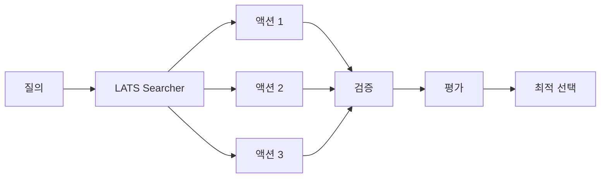
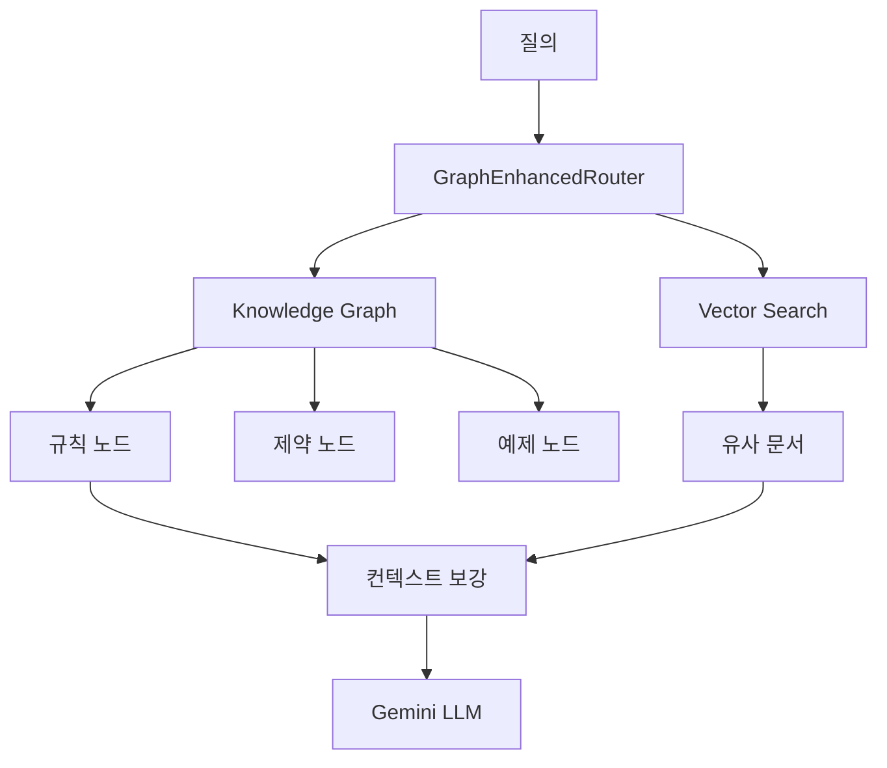

# 고급 기능 가이드 (Advanced Features)

LATS, RAG, 멀티모달 등 고급 기능에 대한 상세 가이드입니다.

---

## 🌳 LATS (Language Agent Tree Search)

LATS는 경량 트리 탐색을 통해 액션 제안, 검증, 평가를 수행하는 고급 워커입니다.

### 활성화

```bash
# .env
ENABLE_LATS=true
REDIS_URL=redis://localhost:6379
```

### 아키텍처



### 주요 기능

- **액션 제안**: 가능한 액션 후보 생성
- **검증**: 각 액션의 유효성 검증
- **평가**: 점수 기반 최적 액션 선택
- **Redis 캐시**: 중간 결과 캐싱
- **예산 추적**: 토큰/비용 실시간 추적

### 워커 실행

```bash
# Docker Compose
docker-compose -f docker-compose.worker.yml up -d

# 직접 실행
python -m src.infra.worker
```

---

## 🔍 RAG (Retrieval-Augmented Generation)

Neo4j 기반 지식 그래프와 벡터 검색을 활용한 RAG 시스템입니다.

### 설치

```bash
pip install -e ".[rag]"
```

### 설정

```bash
# .env
NEO4J_URI=bolt://localhost:7687
NEO4J_USER=neo4j
NEO4J_PASSWORD=your_password
```

### 아키텍처



### 그래프 스키마 구축

```bash
# Notion 데이터에서 지식 그래프 생성
python -m src.graph.builder

# Neo4j Browser에서 확인
# MATCH (n) RETURN labels(n), count(n)
```

### RAG 시스템 테스트

```bash
python -m src.qa.rag_system
```

### 주요 컴포넌트

| 컴포넌트 | 설명 |
|----------|------|
| `QAKnowledgeGraph` | 지식 그래프 관리 |
| `GraphEnhancedRouter` | 질의 라우팅 |
| `VectorStore` | 벡터 검색 인덱스 |
| `RuleNode` | 규칙 노드 |
| `ConstraintNode` | 제약 조건 노드 |
| `ExampleNode` | 예제 노드 |

---

## 🖼️ 멀티모달

이미지 입력을 포함한 멀티모달 처리 기능입니다.

### 설치

```bash
pip install -e ".[multimodal]"
```

### 지원 형식

- **이미지**: PNG, JPEG, GIF, WebP
- **OCR 텍스트**: 이미지에서 추출된 텍스트

### 사용 예시

```python
from src.features.multimodal import process_image

# 이미지 처리
result = await process_image(
    image_path="data/inputs/sample.png",
    query="이 이미지의 내용을 설명해주세요"
)
```

---

## 📊 통합 파이프라인

전체 QA 세션 생성 및 검증을 위한 통합 파이프라인입니다.

### 실행

```bash
python -m src.main --integrated-pipeline --pipeline-meta examples/session_input.json
```

### 파이프라인 단계

1. **세션 구성**: 3~4턴 세션 자동 구성
2. **템플릿 렌더링**: Jinja2 템플릿 처리
3. **질의 생성**: 전략적 질의 생성
4. **후보 평가**: 답변 후보 평가
5. **재작성**: 품질 개선
6. **검증**: 제약 조건 검증

### 세션 입력 형식

```json
{
  "ocr_text": "이미지에서 추출된 텍스트",
  "candidates": {
    "A": "후보 답변 A",
    "B": "후보 답변 B",
    "C": "후보 답변 C"
  },
  "user_intent": "요약",
  "constraints": {
    "max_turns": 4,
    "require_reasoning": true
  }
}
```

---

## 🎯 세션 검증

세션 결과의 품질을 검증합니다.

### 금지 패턴 검출

```bash
python checks/detect_forbidden_patterns.py
```

검출 항목:

- 표/그래프 참조
- 허용되지 않는 형식
- 제약 조건 위반

### 세션 유효성 검증

```bash
python checks/validate_session.py --context examples/session_input.json
```

검증 항목:

- 턴 수 제한 (3~4턴)
- 질의 타입 조합
- 계산 요청 횟수

---

## 💡 고급 사용 팁

### 1. 배치 처리

대량 질의를 청크로 나누어 처리:

```python
from src.workflow.batch_processor import process_queries_in_chunks

results = await process_queries_in_chunks(
    queries=queries,
    chunk_size=10,
    delay_between_chunks=1.0
)
```

### 3. 체크포인트 복구

중단된 작업 재개:

```bash
python -m src.main --resume --checkpoint-file checkpoint.jsonl
```

---

## ⏭️ 관련 문서

- [캐싱 전략](CACHING.md)
- [모니터링](MONITORING.md)
- [아키텍처](ARCHITECTURE.md)
