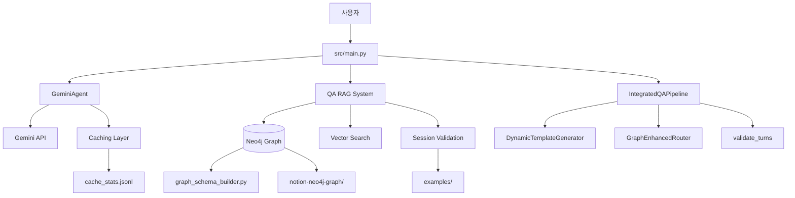

# 시스템 아키텍처

## 전체 구조 개요

shining-quasar는 **Gemini 워크플로우**를 핵심으로 하며, **QA RAG 시스템**을 선택적으로 통합할 수 있는 모듈식 아키텍처입니다.



## 핵심 구성 요소

### 1. 메인 워크플로우 (`src/main.py`)

**역할**: 전체 워크플로우 오케스트레이션

**주요 기능**:

- CLI 인터페이스 제공
- 병렬 처리 관리 (`asyncio.gather`)
- 체크포인트 복구 (`--resume`)
- 비용 추적 및 예산 관리

**의존성**:

- `GeminiAgent`: Gemini API 호출
- `QAKnowledgeGraph`: Neo4j 기반 QA 시스템
- `IntegratedQAPipeline`: 통합 품질 파이프라인

### 2. GeminiAgent (`src/agent.py`)

**역할**: Gemini API 인터페이스 및 비용 관리

**주요 기능**:

- Lazy Import 최적화 (성능 ~20% 향상)
- Rate Limiting (RPM 제어)
- 동시성 제어 (`Semaphore`)
- 컨텍스트 캐싱 (토큰 2000개 이상 시)
- 토큰 사용량 및 비용 추적

**캐싱 전략**:

```python
if prompt_tokens >= 2000:
    cache = await create_context_cache(ocr_text)
    # 로컬 매니페스트: .cache/context_cache.json
```

### 3. QA RAG System (`src/qa_rag_system.py`)

**역할**: Neo4j 그래프 기반 규칙 검색 및 세션 검증

**주요 기능**:

- 벡터 검색 (Gemini Embeddings)
- 그래프 쿼리 (Rule/Constraint/Example)
- Session 검증 (`checks/validate_session.py` 통합)

**데이터 플로우**:

```
Notion 페이지
    ↓
notion-neo4j-graph/import_pipeline.py
    ↓
Neo4j 그래프 (Rule, Constraint, Example 노드)
    ↓
graph_schema_builder.py (스키마 생성)
    ↓
qa_rag_system.py (조회 및 검증)
```

### 4. IntegratedQAPipeline (`src/integrated_qa_pipeline.py`)

**역할**: 통합 품질 관리 파이프라인

**주요 구성 요소**:

- **DynamicTemplateGenerator**: Jinja2 템플릿 동적 생성
  - `templates/system/`, `templates/user/`, `templates/eval/`
- **GraphEnhancedRouter**: 그래프 기반 쿼리 타입 라우팅
- **validate_turns**: 세션 구조 검증 (턴 수, 설명/요약, 추론)

**검증 흐름**:

```python
session = {
    "turns": [...],
    "context": {...}
}
↓
validate_turns(turns, SessionContext)
↓
검증 결과: {"ok": bool, "issues": [...]}
```

## 보조 시스템

### 캐싱 및 통계

**파일**:

- `cache_stats.jsonl`: 캐시 hit/miss 통계
- `.cache/context_cache.json`: 로컬 캐시 매니페스트

**통계 추적**:

- 토큰 사용량 (입력/출력)
- 캐시 적중률
- API 레이턴시 (p50/p90/p99)

**분석 도구**:

```bash
# 캐시 리포트
python -m src.main --analyze-cache

# 레이턴시 분석
python scripts/latency_baseline.py
```

### 템플릿 시스템

**디렉토리 구조**:

```
templates/
├── system/         # 시스템 프롬프트
│   ├── text_image_qa_explanation_system.j2
│   └── text_image_qa_summary_system.j2
├── user/           # 사용자 프롬프트
├── eval/           # 평가 프롬프트
├── rewrite/        # 재작성 프롬프트
└── fact/           # 사실 검증 프롬프트
```

**사용 예시**:

```bash
python scripts/render_prompt.py \
  --template system/text_image_qa_explanation_system.j2 \
  --context examples/session_input.json
```

## 워크플로우 시나리오

### 기본 워크플로우 (Gemini Only)

```
1. OCR 입력 파일 로드
   ↓
2. GeminiAgent.generate_query()
   ├─→ Jinja2 템플릿 렌더링
   ├─→ Gemini API 호출
   └─→ 질의 리스트 반환
   ↓
3. GeminiAgent.evaluate_responses()
   ├─→ 후보 답변 평가
   ├─→ 환각 감지 (best_candidate 검증)
   └─→ EvaluationResultSchema 반환
   ↓
4. GeminiAgent.rewrite_best_answer()
   ├─→ 최우수 답변 재작성
   └─→ 개선된 답변 반환
   ↓
5. 결과 저장 (data/outputs/result_*.md)
```

### 고급 워크플로우 (Gemini + QA RAG)

```
1. OCR 입력 파일 로드
   ↓
2. IntegratedQAPipeline 실행
   ├─→ GraphEnhancedRouter: 쿼리 타입 판단
   │   └─→ Neo4j 그래프 조회
   ├─→ DynamicTemplateGenerator: 템플릿 동적 생성
   │   └─→ QAKnowledgeGraph.find_relevant_rules()
   ├─→ GeminiAgent.generate_query()
   └─→ Session 검증 (validate_turns)
       └─→ checks/validate_session.py
   ↓
3. GeminiAgent.evaluate_responses()
   ├─→ 후보 답변 평가
   ├─→ QAKnowledgeGraph.get_constraints_for_query_type()
   │   └─→ Neo4j Cypher 쿼리
   └─→ EvaluationResultSchema + 제약 검증
   ↓
4. GeminiAgent.rewrite_best_answer()
   ├─→ QAKnowledgeGraph.get_best_practices()
   └─→ 모범 사례 기반 재작성
   ↓
5. 결과 저장 + 세션 검증 리포트
```

## 데이터 흐름

### Neo4j 그래프 구축

```
1. Notion API → notion-neo4j-graph/import_pipeline.py
   ├─→ Rule 노드 추출
   ├─→ Constraint 노드 추출
   └─→ Example 노드 추출
   ↓
2. graph_schema_builder.py
   ├─→ 노드 타입 정의 (Rule, Constraint, QueryType, etc.)
   ├─→ 관계 생성 (APPLIES_TO, ENFORCES, DEMONSTRATES)
   └─→ 벡터 인덱스 생성 (rule_embeddings)
   ↓
3. QAKnowledgeGraph 초기화
   ├─→ Neo4jVector.from_existing_graph()
   └─→ CustomGeminiEmbeddings (text-embedding-004)
```

### Session 검증 흐름

```
1. scripts/build_session.py
   ├─→ examples/session_input.json 로드
   ├─→ SessionContext 생성
   └─→ 3~4턴 세션 구성
   ↓
2. checks/validate_session.py
   ├─→ validate_turns(turns, context)
   ├─→ 턴 수 검증 (3~4)
   ├─→ 설명/요약 슬롯 검증
   ├─→ 추론 필수 여부 검증
   └─→ 금지 패턴 검출 (detect_forbidden_patterns.py)
   ↓
3. tests/test_session_builder.py
   └─→ 자동화된 검증 테스트
```

## 성능 최적화

### Lazy Import

**적용 위치**: `src/agent.py`

**성과**: 초기화 시간 ~20% 단축 (2.84s → 2.28s)

**구현**:

```python
@property
def _genai(self):
    if "_genai_module" not in globals():
        import google.generativeai as genai
        globals()["_genai_module"] = genai
    return globals()["_genai_module"]
```

### 병렬 처리

**적용 위치**: `src/main.py`

```python
tasks = [
    process_single_query(agent, query, ocr_text, candidates)
    for query in queries
]
results = await asyncio.gather(*tasks)
```

### 캐싱 전략

- **조건**: 프롬프트 토큰 ≥ 2000
- **TTL**: 10분 (기본값, `GEMINI_CACHE_TTL_MINUTES`)
- **저장소**: 로컬 매니페스트 + Gemini Context Cache

## 확장 포인트

### 새로운 쿼리 타입 추가

1. Neo4j에 `QueryType` 노드 추가
2. `templates/system/` 에 새 템플릿 생성
3. `GraphEnhancedRouter`에 라우팅 로직 추가

### 새로운 제약 조건 추가

1. Notion 페이지에 제약 정의
2. `notion-neo4j-graph/import_pipeline.py` 실행
3. `checks/detect_forbidden_patterns.py` 업데이트 (필요 시)

### 커스텀 검증 로직

1. `checks/validate_session.py`의 `validate_turns()` 수정
2. `IntegratedQAPipeline`에서 활용

## 환경 변수

| 변수 | 기본값 | 설명 |
|------|--------|------|
| `GEMINI_API_KEY` | 필수 | Gemini API 키 |
| `NEO4J_URI` | `bolt://localhost:7687` | Neo4j 접속 URI |
| `NEO4J_USER` | `neo4j` | Neo4j 사용자명 |
| `NEO4J_PASSWORD` | 필수 (RAG 사용 시) | Neo4j 비밀번호 |
| `GEMINI_MAX_CONCURRENCY` | `5` | 최대 동시 요청 수 |
| `GEMINI_CACHE_TTL_MINUTES` | `10` | 캐시 TTL |
| `CACHE_STATS_FILE` | `cache_stats.jsonl` | 캐시 통계 파일 |

## 참고 문서

- [README.md](../README.md): 빠른 시작 가이드
- [ENVIRONMENT_SETUP.md](ENVIRONMENT_SETUP.md): 환경 설정
- [PRINCIPLES_REVIEW.md](PRINCIPLES_REVIEW.md): 코드 품질 분석
- [UV_GUIDE.md](../UV_GUIDE.md): UV 패키지 매니저
