[](https://github.com/hamtoy/Test/actions/workflows/ci.yml)
[](https://codecov.io/gh/hamtoy/Test)

# Gemini 워크플로우 - Q&A 시스템

Google Gemini AI를 활용한 Q&A 응답 평가 및 재작성 워크플로우 시스템입니다.

## 주요 기능

- 🤖 **질의 생성**: OCR 텍스트에서 질의 자동생성
- 📊 **후보 평가**: 여러 답변 후보 평가 및 점수 부여
- ✍️ **답변 재작성**: 선택된 답변의 품질 개선
- 🌳 **LATS 워커**: 경량 트리 탐색(LATS)으로 액션 제안/검증/평가, Redis 캐시와 예산 추적 연동
- 💰 **비용 추적**: BudgetTracker로 토큰/비용 집계 및 한도 경고
- 🛡️ **안정성**: Rate limiting, 타입 검증, 환각 감지, Redis 장애 시 fail-open 처리
- 🎨 **사용자 인터페이스**: Rich 기반 콘솔 출력
- 🧪 **테스트**: pytest + coverage (현재 전체 커버리지 약 84%)

## 프로젝트 구조

```
project_root/
├── .env                    # 환경 변수 (API 키)
├── .env.example            # 환경 변수 템플릿
├── pyproject.toml          # 프로젝트 메타데이터/의존성
├── .pre-commit-config.yaml # pre-commit 훅 설정
├── README.md               # 문서
├── UV_GUIDE.md             # UV 패키지 매니저 가이드
├── MIGRATION.md            # Import path 마이그레이션 가이드
├── checks/                 # Session 검증
│   ├── detect_forbidden_patterns.py
│   └── validate_session.py
├── data/
│   ├── inputs/             # 입력 파일
│   └── outputs/            # 출력 파일 (Markdown)
├── docs/                   # 상세 문서
│   ├── ARCHITECTURE.md     # 시스템 아키텍처
│   ├── ENVIRONMENT_SETUP.md
│   └── ...
├── examples/               # 예제 데이터
│   └── session_input.json
├── notion-neo4j-graph/     # Neo4j 데이터 임포트
├── scripts/                # 유틸리티 스크립트
│   ├── dev/auto_profile.py
│   ├── analysis/compare_runs.py
│   └── ...
├── src/                    # 소스 코드 (모듈화된 패키지 구조)
│   ├── main.py             # 메인 워크플로우 진입점 (대화형 메뉴)
│   │
│   ├── agent/              # AI Agent 핵심 기능
│   │   ├── core.py         # GeminiAgent 클래스
│   │   ├── cost_tracker.py # 비용 추적
│   │   ├── cache_manager.py# 캐시 관리
│   │   └── rate_limiter.py # Rate limiting
│   │
│   ├── config/             # 설정 및 상수
│   │   ├── settings.py     # AppConfig
│   │   ├── constants.py    # 상수 정의
│   │   └── exceptions.py   # 예외 클래스
│   │
│   ├── core/               # 핵심 인터페이스와 모델
│   │   ├── models.py       # Pydantic 모델
│   │   ├── interfaces.py   # 인터페이스 정의
│   │   ├── prompts.py      # 프롬프트 관리
│   │   └── schema.py       # 스키마 정의
│   │
│   ├── qa/                 # Q&A 및 RAG 시스템
│   │   ├── rag_system.py   # QAKnowledgeGraph
│   │   ├── generator.py    # Q&A 생성
│   │   ├── factory.py      # QA 시스템 팩토리
│   │   ├── pipeline.py     # 통합 파이프라인
│   │   ├── quality.py      # 품질 시스템
│   │   ├── memory_augmented.py
│   │   └── multi_agent.py
│   │
│   ├── caching/            # 캐시 관리
│   │   ├── layer.py        # CachingLayer
│   │   ├── analytics.py    # 캐시 분석
│   │   └── redis_eval.py   # Redis 평가 캐시
│   │
│   ├── llm/                # LLM 클라이언트 및 체인
│   │   ├── gemini.py       # GeminiModelClient
│   │   ├── lcel_chain.py   # LCEL 최적화 체인
│   │   ├── langchain_system.py
│   │   └── list_models.py
│   │
│   ├── analysis/           # 의미 분석 및 검증
│   │   ├── semantic.py     # 의미 분석
│   │   ├── cross_validation.py
│   │   └── comparison.py
│   │
│   ├── processing/         # 데이터 로딩 및 변환
│   │   ├── loader.py       # 데이터 로더
│   │   ├── template_generator.py
│   │   ├── example_selector.py
│   │   └── context_augmentation.py
│   │
│   ├── features/           # 추가 기능
│   │   ├── autocomplete.py
│   │   ├── multimodal.py
│   │   ├── self_correcting.py
│   │   ├── lats_searcher.py
│   │   ├── difficulty.py
│   │   └── action_executor.py
│   │
│   ├── infra/              # 인프라 및 유틸리티
│   │   ├── utils.py        # 공통 유틸리티
│   │   ├── logging.py      # 로깅 설정
│   │   ├── budget.py       # 예산 추적
│   │   ├── neo4j.py        # Neo4j 유틸리티
│   │   ├── worker.py       # LATS 워커
│   │   ├── health.py       # 헬스체크
│   │   ├── callbacks.py    # 콜백
│   │   └── constraints.py  # 제약 조건
│   │
│   ├── routing/            # 요청 라우팅
│   │   └── graph_router.py # GraphEnhancedRouter
│   │
│   ├── graph/              # 그래프 스키마 및 빌드
│   ├── ui/                 # 사용자 인터페이스
│   └── workflow/           # 워크플로우 실행
│
├── templates/              # Jinja2 템플릿 (15개)
│   ├── system/             # 시스템 프롬프트
│   ├── user/               # 사용자 프롬프트
│   ├── eval/               # 평가 프롬프트
│   └── ...
└── tests/                  # 테스트 스위트(pytest, 커버리지 80%+)
    ├── test_agent.py
    ├── test_worker_process.py
    ├── test_qa_rag_system.py
    └── ...
```

## 시스템 개요

이 시스템은 다음 작업을 수행합니다:

- OCR 텍스트를 기반으로 검색 질의 생성
- 여러 후보 답변을 평가하고 점수 부여
- 최고 점수 답변을 재작성하여 품질 개선
- 토큰 사용량 및 비용 추적
- 입력 검증 및 환각 감지

### 시스템 구성

**워크플로우 다이어그램 (Mermaid)**

```mermaid
flowchart LR
    A[OCR 입력] --> B[질의 생성]
    B --> C[후보 평가]
    C --> D[답변 재작성]
    D --> E[결과 출력]

    C -.->|옵션: QA RAG| F[Neo4j 그래프]
    F -.-> G[벡터 검색]
    F -.-> H["Session 검증 (checks/)"]
    
    style F fill:#2d3748,stroke:#718096,stroke-dasharray: 5 5
    style G fill:#2d3748,stroke:#718096,stroke-dasharray: 5 5
    style H fill:#2d3748,stroke:#718096,stroke-dasharray: 5 5
```



> **기본 워크플로우** (실선): OCR 입력 → 질의 생성 → 후보 평가 → 답변 재작성 → 결과 출력  
> **선택적 RAG 경로** (점선): 후보 평가 시점에 Neo4j 그래프/벡터 검색/Session 검증을 통해 평가 품질을 보강할 수 있습니다.

> [!NOTE]
> Neo4j와 Notion은 **QA RAG 시스템** 사용 시에만 필요합니다. 기본 워크플로우는 Gemini API만으로 동작합니다.

## 시작하기

### 필수 요구사항

- Python 3.10 이상
- Google Gemini API 키 ([발급 링크](https://makersuite.google.com/app/apikey))

### 선택 요구사항 (QA RAG 시스템 사용 시)

- Neo4j 데이터베이스 ([Aura 무료](https://neo4j.com/cloud/aura-free/))
- Notion 계정 (규칙 데이터 소스)
- Neo4j 연결은 `src/neo4j_utils.py`의 `create_sync_driver`/`SafeDriver`를 통해 생성하면 컨텍스트 매니저로 자동 정리되며, 종료 시점에 반드시 `close()`가 호출되도록 보장합니다.

### 설치

#### pip 사용

```bash
cd shining-quasar
pip install -e .
# 개발/테스트/문서 의존성까지 설치
pip install -e ".[dev]"
```

### Neo4j 프로브(선택)

대표 쿼리/벡터 검색 latency를 빠르게 점검하려면:

```bash
python scripts/neo4j/neo4j_benchmark_stub.py
```

> `NEO4J_URI`, `NEO4J_USER`, `NEO4J_PASSWORD`가 설정되어 있을 때만 실행되며, 미설정 시 안전하게 스킵됩니다.
>
> 예시 출력:
>
> ```
> Neo4j credentials missing; skipping probe.
> ```
>
> 또는 벡터 스토어가 있을 경우:
>
> ```
> constraints: 42.1 ms, rows=5
> best_practices: 35.7 ms, rows=3
> examples: 28.4 ms, rows=3
> vector_search: 50.2 ms, rows=1
> ```

### 예산/코스트 알림

- 워크플로우 실행 중 예산 임계(80/90/95%) 도달 시 콘솔 경고와 패널로 알려줍니다.
- 세션 종료 시 비용/토큰/캐시 통계를 패널로 요약 표시하고, `cache_stats.jsonl`에 최근 항목을 남깁니다.

#### uv 사용

```bash
pip install uv
uv sync                # 런타임 의존성
uv sync --extra dev    # 개발/테스트/문서 의존성 포함
```

자세한 내용은 [UV_GUIDE.md](UV_GUIDE.md)를 참조하세요.

## 📦 Import 가이드

프로젝트는 모듈화된 패키지 구조를 사용합니다. 권장 import 패턴:

### 설정 및 상수

```python
from src.config import AppConfig                    # 앱 설정
from src.config.constants import ERROR_MESSAGES     # 상수
from src.config.exceptions import BudgetExceededError  # 예외
```

### 핵심 모델 및 인터페이스

```python
from src.core.models import WorkflowResult, EvaluationResultSchema
from src.core.interfaces import IAgent
```

### Agent

```python
from src.agent import GeminiAgent
from src.agent.cost_tracker import CostTracker
```

### Q&A 시스템

```python
from src.qa.rag_system import QAKnowledgeGraph
from src.qa.generator import QAGenerator
from src.qa.factory import QASystemFactory
```

### LLM 클라이언트

```python
from src.llm.gemini import GeminiModelClient
from src.llm.langchain_system import UltimateLangChainQASystem
```

### 인프라 및 유틸리티

```python
from src.infra.utils import clean_markdown_code_block
from src.infra.logging import setup_logging, log_metrics
from src.infra.neo4j import SafeDriver, create_sync_driver
```

### 캐싱

```python
from src.caching.layer import CachingLayer
from src.caching.analytics import analyze_cache_stats
```

> **참고**: 이전 버전의 import 경로(예: `from src.utils import ...`)는 여전히 작동하지만 deprecation 경고가 표시됩니다.  
> 마이그레이션 가이드는 [MIGRATION.md](MIGRATION.md)를 참조하세요.

## ⚡️ Quick Start

1) `.env`에서 `GEMINI_API_KEY` 설정  
2) 대화형 메뉴 실행:

```bash
python -m src.main
```

실행 후 대화형 메뉴가 표시됩니다:

```
═══ Gemini Workflow System ═══
규칙 준수 리라이팅 · 검수 반려 방지

상태: Neo4j ✓ | LATS ✓

1. 🔄 질의 생성 및 평가
2. ✅ 검수 (질의/답변)
3. 📊 캐시 통계 분석
4. 🚪 종료

선택 [1]:
```

### 성능/관측 도구

```bash
# 캐시 통계 요약 (CACHE_STATS_FILE 기반)
python -m src.main --analyze-cache
make -C docs cache-report  # make 도움말 위치: docs/Makefile

# 로그에서 API latency p50/p90/p99 집계
python scripts/latency_baseline.py --log-file app.log
make -C docs latency
```

3) 결과는 `data/outputs/`에 저장됩니다.

### 개발 환경 (권장)

개발/테스트 시 필요한 도구를 설치하고 pre-commit 훅을 활성화하세요.

```bash
pip install -e ".[dev]"
pre-commit install
# 첫 실행 시 전체 파일 검사
pre-commit run --all-files
```

### 빠른 품질 검사(권장)

```bash
pre-commit run --all-files        # ruff + ruff-format + mypy
uv run pytest tests/ --cov=src --cov-fail-under=80
```

### CI 파이프라인

GitHub Actions에서 자동으로 실행되는 검증 단계:

1. `ruff check` - 린트 검사
2. `ruff format --check` - 포맷 검사
3. `mypy` - 타입 체크
4. `pytest --cov=src --cov-fail-under=80` - 테스트 및 커버리지

로컬에서 동일하게 실행하려면 `pre-commit run --all-files` 사용

### 템플릿/세션 도구

```bash
# 템플릿 렌더링 예시
uv run python scripts/render_prompt.py --template system/qa/explanation.j2 --context examples/session_input.json

# 세션 빌드 및 검증
uv run python scripts/build_session.py --context examples/session_input.json
uv run python checks/validate_session.py --context examples/session_input.json
uv run python scripts/dev/run_pipeline.py --context examples/session_input.json
```

### 환경 설정

`.env.example`을 복사하여 `.env` 파일 생성:

```bash
cp .env.example .env
```

`.env` 파일 편집:

```bash
# 필수
GEMINI_API_KEY=your_api_key_here

# 선택 사항 - Gemini 설정 (기본값 제공)
GEMINI_MODEL_NAME=gemini-3-pro-preview
GEMINI_MAX_OUTPUT_TOKENS=8192
GEMINI_TIMEOUT=120
GEMINI_MAX_CONCURRENCY=5
GEMINI_TEMPERATURE=0.2
GEMINI_CACHE_SIZE=50
GEMINI_CACHE_TTL_MINUTES=10
LOG_LEVEL=INFO

# 선택 사항 - QA RAG 시스템 사용 시
NEO4J_URI=bolt://localhost:7687
NEO4J_USER=neo4j
NEO4J_PASSWORD=password
```

다른 디렉토리에서 실행할 경우 `PROJECT_ROOT`를 설정할 수 있습니다.

API 키 확인:

```bash
python -m src.list_models
```

### 입력 파일 준비

`data/inputs/` 디렉토리에 파일 배치:

- OCR 텍스트: `data/inputs/input_ocr.txt`
- 후보 답변: `data/inputs/input_candidates.json`

### 실행 (대화형 메뉴)

시스템은 사용자 친화적인 대화형 메뉴 인터페이스를 제공합니다:

```bash
python -m src.main
```

### 메뉴 기능

#### 1. 질의 생성 및 평가 🔄

- OCR 파일 및 후보 답변 파일 선택
- 사용자 의도 입력 (선택사항)
- 전략적 질의 자동 생성
- 각 질의에 대한 평가 및 재작성 실행

**사용 방법:**

1. 메뉴에서 `1` 선택
2. OCR 파일명 입력 (기본: `input_ocr.txt`)
3. 후보 답변 파일명 입력 (기본: `input_candidates.json`)
4. 사용자 의도 입력 (선택)
5. 생성된 질의 확인 후 진행

#### 2. 검수 (질의/답변) ✅

- 질의 검수: 직접 입력 모드 지원 예정
- 답변 검수: 외부 파일 기반 검수 지원 예정

#### 3. 캐시 통계 분석 📊

- 캐시 hit/miss 비율 확인
- 비용 절감 효과 분석
- 토큰 사용 통계

#### 4. 종료 🚪

시스템 종료

### 기능 플래그 자동 감지

시스템은 `.env` 파일에서 다음 기능들을 자동으로 감지하고 메뉴에 표시합니다:

- **Neo4j** (`NEO4J_URI`): 그래프 데이터베이스 연동
- **LATS** (`ENABLE_LATS=true`): 언어 에이전트 트리 탐색
- **Data2Neo** (`ENABLE_DATA2NEO=true`): 데이터-Neo4j 변환
- **Redis** (`REDIS_URL`): 캐시 서버 연동

## 출력 및 로그

- 결과: `data/outputs/result_turn_<id>_<timestamp>.md`
- 콘솔: Rich 포맷 출력
- 로그 파일: `app.log`
- 캐싱: 프롬프트 토큰이 2000개 이상일 때만 활성화
- **캐시 통계**: `cache_stats.jsonl`(기본)로 누적 저장
  - 파일 경로: `CACHE_STATS_FILE` 환경 변수로 변경 가능
  - 보존 개수: `CACHE_STATS_MAX_ENTRIES`로 조정 가능
  - 통계 확인: `python -m src.main --analyze-cache`
- 로그 분리: INFO+ → `app.log`, ERROR+ → `error.log` (JSON 포맷은 production 모드에서 자동 적용)
- 체크포인트: `--resume` 사용 시 `checkpoint.jsonl`(기본)에서 완료된 질의를 건너뜀. `--checkpoint-file`로 경로 지정 가능
- **프로파일링 결과**: `profiling_results/` 디렉토리에 `.prof` 파일 저장

## 성능 분석

### API Latency 통계

로그 파일에서 API 호출 레이턴시를 분석하여 백분위수 통계를 확인할 수 있습니다:

```bash
# 기본 로그 파일 분석 (app.log)
python scripts/latency_baseline.py

# 사용자 지정 로그 파일
python scripts/latency_baseline.py --log-file custom.log

# 여러 로그 파일 통합 분석
python scripts/latency_baseline.py --log-file run1.log --log-file run2.log
```

출력 예시:

```
┏━━━━━━━━┳━━━━━━━━┓
┃ Metric ┃ Value  ┃
┡━━━━━━━━╇━━━━━━━━┩
│ Count  │ 150    │
│ Min    │ 45.23  │
│ Mean   │ 234.56 │
│ Max    │ 892.10 │
│ p50    │ 210.34 │
│ p90    │ 356.78 │
│ p99    │ 678.90 │
└────────┴────────┘
```

## 개발 도구

### 성능 분석

- **프로파일링**: `python scripts/dev/auto_profile.py src.main --mode AUTO --ocr-file example_ocr.txt --cand-file example_candidates.json --intent "요약"`
  - 병목 상위 20개 표시 (`--` 구분은 선택 사항)
  - 결과 저장: `profiling_results/{module_name}_stats.prof`
  
- **레이턴시 분석**: `python scripts/latency_baseline.py --log-file app.log`
  - API 호출 레이턴시 통계 (p50/p90/p99)

### 결과 분석

- **결과 비교**: `python scripts/analysis/compare_runs.py --sort-by cost`
  - `data/outputs/result_*.md` 파일을 표로 정렬/요약
  
- **캐시 분석**: `python -m src.main --analyze-cache`
  - 캐시 hit/miss, 비용 절감 계산

### 데이터 관리

- **백업**: `pwsh scripts/backup.ps1`
  - 데이터·로그를 날짜별 ZIP으로 압축
  - 기본값: `.env` 포함
  - 민감정보 제외: `-SkipEnv` 옵션 사용

## 출력 예시

```
INFO     리소스 로드 중...
INFO     Rate limiter enabled: 60 requests/minute
INFO     워크플로우 시작 (Mode: AUTO)
INFO     질의 생성 중...
INFO     Token Usage - Prompt: 3,095, Response: 45, Total: 4,929
INFO     질의 생성 완료...
INFO     후보 평가 중...
INFO     Token Usage - Prompt: 4,908, Response: 282, Total: 7,123
INFO     후보 선정 완료: A
INFO     답변 재작성 중...
INFO     Token Usage - Prompt: 3,681, Response: 867, Total: 6,316

🤖 Query: 핵심 내용 요약
📊 Selected Candidate: A

╭─ 📝 Final Output ──────────────────────────╮
│ # 요약                                     │
│                                            │
│ 주요 내용:                                 │
│ 1. 첫 번째 요점                            │
│ 2. 두 번째 요점                            │
╰────────────────────────────────────────────╯

╭─ 비용 요약 ───────────────────────────────╮
│ 💰 총 비용: $0.0534 USD                   │
│ 📊 토큰: 11,684 입력 / 1,194 출력         │
│ 📈 캐시: 5 hit / 2 miss                   │
╰────────────────────────────────────────────╯
```

## 테스트

```bash
# 전체 테스트
pytest tests/ -v

# 특정 테스트
pytest tests/test_agent.py -v

# 커버리지 포함
pytest tests/ --cov=src --cov-report=html

# 빠른 피드백 루프
uv run pytest-watcher .
uv run pytest -n auto --ff tests/
```

## 개발 가이드

### 주요 모듈

> **참고**: v3.0부터 새로운 패키지 기반 아키텍처를 사용합니다. 자세한 내용은 [BREAKING_CHANGES_v3.md](BREAKING_CHANGES_v3.md)를 참조하세요.

- `src/agent/`: Gemini API 호출, 재시도, rate limiting, 비용 추적
  - `core.py`: GeminiAgent 핵심 클래스
  - `cost_tracker.py`: 비용 추적 및 예산 관리
  - `rate_limiter.py`: API 호출 제한 관리
  - `batch_processor.py`: 배치 처리 시스템
- `src/caching/`: 캐싱 인프라
  - `analytics.py`: 캐시 통계 분석 및 비용 절감 계산
  - `layer.py`: 캐싱 레이어 추상화
  - `redis_cache.py`: Redis 기반 캐시
- `src/config/`: 환경 변수 기반 설정 관리
  - `settings.py`: AppConfig 설정 클래스
  - `constants.py`: 가격 티어, 예산 임계값, UI 메시지 템플릿
  - `exceptions.py`: 사용자 정의 예외 (API 제한, 예산 초과 등)
- `src/core/`: 핵심 모델 및 인터페이스
  - `models.py`: 환각 감지 기능이 포함된 Pydantic 모델
  - `schemas.py`: 데이터 스키마 정의
- `src/infra/`: 인프라 유틸리티
  - `logging.py`: 콘솔/파일 로깅 분리, 민감 데이터 마스킹
  - `utils.py`: 파일 처리 및 파싱 유틸리티
  - `neo4j.py`: Neo4j 연결 관리
- `src/processing/`: 데이터 처리
  - `loader.py`: 타입 검증을 포함한 데이터 로딩
- `src/qa/`: Q&A 시스템 컴포넌트
  - `rag_system.py`: RAG 및 그래프 기반 QA 시스템
  - `quality.py`: 통합 품질 관리 파이프라인
  - `pipeline.py`: 통합 QA 파이프라인
- `src/workflow/`: 워크플로우 오케스트레이션
  - `executor.py`: 워크플로우 실행
- `src/main.py`: 메인 진입점 및 인터랙티브 메뉴 시작

### 주요 기능

#### 환각 감지

LLM이 선택한 후보가 실제 점수와 일치하는지 검증:

```python
@model_validator(mode='after')
def validate_best_candidate(self):
    actual_best = max(self.evaluations, key=lambda x: x.score)
    if self.best_candidate != actual_best.candidate_id:
        logger.warning("LLM Hallucination Detected - Auto-correcting")
        self.best_candidate = actual_best.candidate_id
```

#### Rate Limiting

- **Semaphore**: 동시 API 호출 수 제한
- **Rate Limiter**: 분당 요청 수 제한
- `429 Too Many Requests` 오류 방지

#### Dependency Injection

테스트와 프로덕션 환경 분리:

```python
# 프로덕션
agent = GeminiAgent(config, jinja_env=real_env)

# 테스트
agent = GeminiAgent(config, jinja_env=mock_env)
```

#### 병렬 처리

여러 질의를 동시에 처리하여 성능 향상:

```python
# asyncio.gather를 사용한 병렬 쿼리 처리
results = await asyncio.gather(*[
    process_single_query(agent, query, ocr_text, candidates)
    for query in queries
])
```

## 환경 변수

| 변수                       | 기본값                 | 설명               |
| -------------------------- | ---------------------- | ------------------ |
| `GEMINI_API_KEY`           | 필수                   | Gemini API 키      |
| `GEMINI_MODEL_NAME`        | `gemini-3-pro-preview` | 사용할 모델        |
| `GEMINI_MAX_OUTPUT_TOKENS` | `8192`                 | 최대 출력 토큰 수  |
| `GEMINI_TIMEOUT`           | `120`                  | API 타임아웃 (초)  |
| `GEMINI_MAX_CONCURRENCY`   | `5`                    | 최대 동시 요청 수  |
| `GEMINI_TEMPERATURE`       | `0.2`                  | 샘플링 온도        |
| `GEMINI_CACHE_SIZE`        | `50`                   | 컨텍스트 캐시 크기 |
| `GEMINI_CACHE_TTL_MINUTES` | `10`                   | 캐시 TTL (분)      |
| `LOG_LEVEL`                | `INFO`                 | 로그 레벨          |
| `CACHE_STATS_FILE`         | `cache_stats.jsonl`    | 캐시/토큰 통계 파일 경로 |
| `CACHE_STATS_MAX_ENTRIES`  | `100`                  | 통계 파일 보존 개수 |
| `LOCAL_CACHE_DIR`          | `.cache`               | 로컬 캐시 메타 저장 폴더 |
| `LOG_FILE`                 | `app.log`              | INFO+ 로그 파일 경로 |
| `ERROR_LOG_FILE`           | `error.log`            | ERROR+ 로그 파일 경로 |
| `PROJECT_ROOT`             | 자동 감지              | 프로젝트 루트 경로 |
| `NEO4J_URI`                | `bolt://localhost:7687`| Neo4j 접속 URI     |
| `NEO4J_USER`               | `neo4j`                | Neo4j 사용자명     |
| `NEO4J_PASSWORD`           | 필수                   | Neo4j 비밀번호     |

자동 감지는 `.git`, `templates`, `data` 폴더를 기준으로 수행됩니다.

## FAQ

- **GEMINI_API_KEY 형식 오류가 뜹니다.** → `AIza`로 시작하고 총 39자여야 합니다. `.env`에서 공백/따옴표가 섞여 있지 않은지 확인하세요.
- **커버리지 기준은 얼마인가요?** → CI에서 `--cov-fail-under=80`을 사용합니다. 로컬에서도 동일하게 실행됩니다.
- **캐시 통계 파일은 어디에 저장되나요?** → 기본 `cache_stats.jsonl`이며, `CACHE_STATS_FILE`로 경로를, `CACHE_STATS_MAX_ENTRIES`로 보존 개수를 설정할 수 있습니다.

## 구현된 기능

- **타입 안정성**: Pydantic Literal 사용
- **예외 처리**: 다중 레이어 에러 핸들링
- **Rate Limiting**: 동시성 및 RPM 제어
- **비용 추적**: 실시간 토큰 사용량 계산
- **로깅**: 콘솔 및 파일 분리, API 키 마스킹
- **테스트**: Dependency Injection 지원
- **검증**: 입력 유효성 검사 및 환각 감지
- **병렬 처리**: 여러 쿼리 동시 처리
- **캐시 모니터링**: 캐시 hit/miss 추적

## 문서

- **[UV_GUIDE.md](UV_GUIDE.md)**: UV 패키지 매니저 사용 가이드
- **[CONTRIBUTING.md](docs/CONTRIBUTING.md)**: 기여 가이드라인
- **[DEPLOYMENT_VERIFIED.md](DEPLOYMENT_VERIFIED.md)**: 배포 검증 내역
- **[ARCHITECTURE.md](docs/ARCHITECTURE.md)**: 시스템 아키텍처
- **[API.md](docs/API.md)**: API 레퍼런스
- **[DEPRECATION.md](DEPRECATION.md)**: Deprecation 정책 및 일정
- **Sphinx 문서**: `docs/` 디렉토리에서 `make html` 실행

## 즉시 실행 가능 - QA 시스템 구축

### 1. 그래프 스키마 구축

```bash
python -m src.graph.builder
```

Notion 가이드에서 Rule/Constraint/Example을 추출하여 Neo4j 지식 그래프를 생성합니다.

### 2. Neo4j Browser에서 확인

```cypher
MATCH (n) RETURN labels(n), count(n)
```

생성된 노드 타입별 개수를 확인합니다.

### 3. RAG 시스템 테스트

```bash
python -m src.qa.rag_system
```

벡터 검색 기반 규칙 조회 및 제약 조건/모범 사례를 확인합니다.

### 4. 통합 파이프라인 실행

```bash
python -m src.main --integrated-pipeline --pipeline-meta examples/session_input.json
```

전체 QA 세션 생성 및 검증을 실행합니다.

---

## Text-Image QA 템플릿 시스템

Notion 가이드 기반 텍스트 중심 이미지 QA 세션 생성 시스템입니다.

### 주요 구성요소

**템플릿:**

- `templates/system/` - 설명문, 요약문, 추론, 전역 시스템 프롬프트
- `templates/user/` - 타겟 질의, 일반 사용자 입력
- `templates/eval/` - 3개 답변 비교 평가
- `templates/rewrite/` - 최고 답변 재작성
- `templates/fact/` - 사실 검증

**도구:**

- `scripts/build_session.py` - 3~4턴 세션 자동 구성
- `scripts/render_prompt.py` - 템플릿 렌더링
- `checks/detect_forbidden_patterns.py` - 금지 패턴 검출

### 빠른 시작

```bash
# 기본 세션 생성
python scripts/build_session.py

# 커스텀 컨텍스트로 세션 생성
python scripts/build_session.py --context examples/session_input.json

# 단일 템플릿 렌더링
python scripts/render_prompt.py --template system/qa/explanation.j2
```

### 주요 제약사항

- 세션당 3~4턴 제한
- 설명문/요약문 중 하나만 사용 (4턴 시 예외적 동시 허용)
- 추론 질의 가능한 경우 필수 포함
- 계산 요청 세션당 1회 제한
- 표/그래프 참조 금지 (텍스트만 사용)

자세한 내용은 `docs/guide_mapping.md`를 참조하세요.

---

## 🐳 Docker 실행

### 개발 환경

```bash
# 전체 스택 실행
docker-compose up -d

# 로그 확인
docker-compose logs -f app

# 종료
docker-compose down
```

### 프로덕션 배포

```bash
# 이미지 pull
docker pull ghcr.io/hamtoy/test:latest

# 실행
docker run -d \
  --name shining-quasar \
  -e GEMINI_API_KEY=your_key \
  -e REDIS_URL=redis://redis:6379 \
  -e NEO4J_URI=bolt://neo4j:7687 \
  -p 8000:8000 \
  ghcr.io/hamtoy/test:latest
```

### Docker Compose 워커

프로덕션 LATS 워커 실행:

```bash
docker-compose -f docker-compose.worker.yml up -d
```

---

## 📊 모니터링

### 헬스체크

- `GET /health` - 전체 시스템 상태 (Redis, Neo4j, Gemini API, 디스크, 메모리)
- `GET /health/ready` - Kubernetes readiness probe (Redis, Neo4j만 체크)
- `GET /health/live` - Kubernetes liveness probe (프로세스 생존 확인)

### 메트릭

- `GET /metrics` - Prometheus 메트릭 엔드포인트

### 환경 변수

| 변수 | 기본값 | 설명 |
|------|--------|------|
| `ENVIRONMENT` | `development` | 환경 (development/staging/production) |
| `LOG_LEVEL_OVERRIDE` | - | 로그 레벨 강제 지정 |
| `GEMINI_API_KEY` | 필수 | Gemini API 키 |
| `REDIS_URL` | - | Redis 연결 URL |
| `NEO4J_URI` | - | Neo4j 연결 URI |

---

## 라이선스

MIT License

## 참고 라이브러리

- [Google Gemini AI](https://ai.google.dev/)
- [Pydantic](https://docs.pydantic.dev/)
- [Rich](https://rich.readthedocs.io/)
- [Tenacity](https://tenacity.readthedocs.io/)
