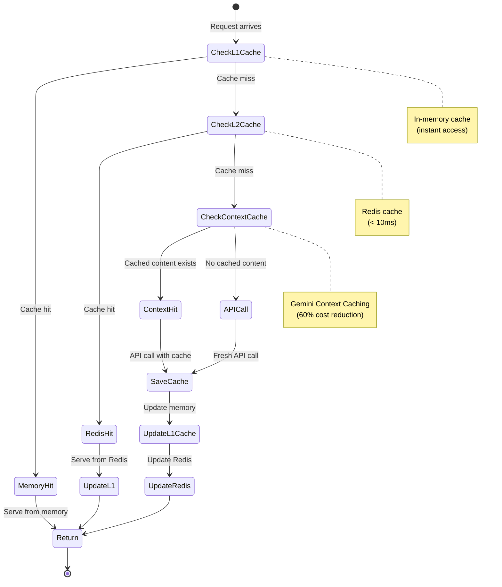

# 캐싱 전략 플로우

```mermaid
stateDiagram-v2
    [*] --> CheckL1Cache: Request arrives
    
    CheckL1Cache --> MemoryHit: Cache hit
    CheckL1Cache --> CheckL2Cache: Cache miss
    
    CheckL2Cache --> RedisHit: Cache hit
    CheckL2Cache --> CheckContextCache: Cache miss
    
    MemoryHit --> Return: Serve from memory
    RedisHit --> UpdateL1: Serve from Redis
    UpdateL1 --> Return
    
    CheckContextCache --> ContextHit: Cached content exists
    CheckContextCache --> APICall: No cached content
    
    ContextHit --> SaveCache: API call with cache
    APICall --> SaveCache: Fresh API call
    
    SaveCache --> UpdateL1Cache: Update memory
    UpdateL1Cache --> UpdateRedis: Update Redis
    UpdateRedis --> Return
    
    Return --> [*]
    
    note right of CheckL1Cache
        In-memory cache
        (instant access)
    end note
    
    note right of CheckL2Cache
        Redis cache
        (< 10ms)
    end note
    
    note right of CheckContextCache
        Gemini Context Caching
        (60% cost reduction)
    end note
```
