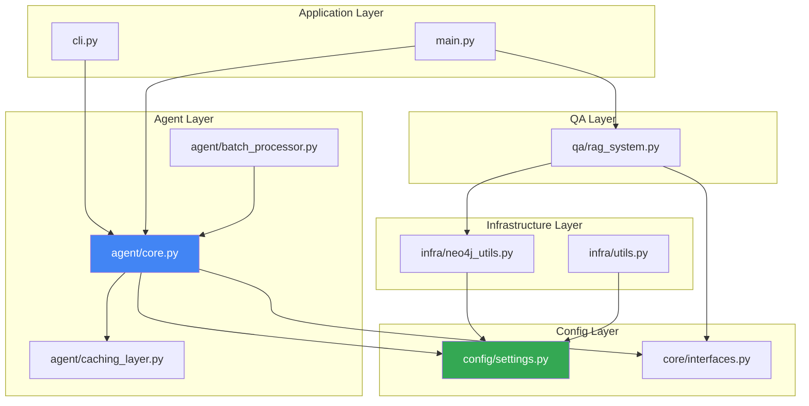

# 컴포넌트 의존성 다이어그램

```mermaid
graph TD
    subgraph "Application Layer"
        CLI[cli.py]
        API[main.py]
    end
    
    subgraph "Agent Layer"
        Core[agent/core.py]
        Batch[agent/batch_processor.py]
        Cache[agent/caching_layer.py]
    end
    
    subgraph "QA Layer"
        RAG[qa/rag_system.py]
    end
    
    subgraph "Infrastructure Layer"
        Neo4jUtil[infra/neo4j_utils.py]
        Utils[infra/utils.py]
    end
    
    subgraph "Config Layer"
        Settings[config/settings.py]
        Interfaces[core/interfaces.py]
    end
    
    CLI --> Core
    API --> Core
    API --> RAG
    
    Core --> Cache
    Core --> Settings
    Batch --> Core
    
    RAG --> Neo4jUtil
    RAG --> Interfaces
    
    Neo4jUtil --> Settings
    Utils --> Settings
    
    Core --> Interfaces
    
    style Core fill:#4285f4,color:#fff
    style Settings fill:#34a853,color:#fff
```
