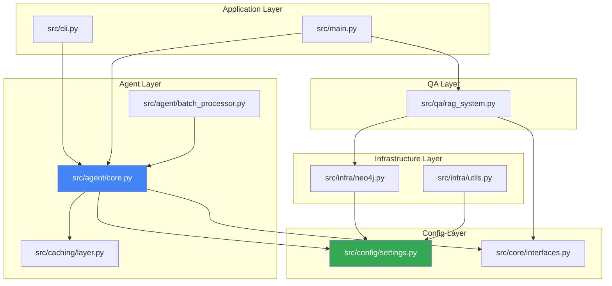

# 컴포넌트 의존성 다이어그램

```mermaid
graph TD
    subgraph "Application Layer"
        CLI[src/cli.py]
        Main[src/main.py]
    end
    
    subgraph "Agent Layer"
        Core[src/agent/core.py]
        Batch[src/agent/batch_processor.py]
        Cache[src/caching/layer.py]
    end
    
    subgraph "QA Layer"
        RAG[src/qa/rag_system.py]
    end
    
    subgraph "Infrastructure Layer"
        Neo4jUtil[src/infra/neo4j.py]
        Utils[src/infra/utils.py]
    end
    
    subgraph "Config Layer"
        Settings[src/config/settings.py]
        Interfaces[src/core/interfaces.py]
    end
    
    CLI --> Core
    Main --> Core
    Main --> RAG
    
    Core --> Cache
    Core --> Settings
    Batch --> Core
    
    RAG --> Neo4jUtil
    RAG --> Interfaces
    
    Neo4jUtil --> Settings
    Utils --> Settings
    
    Core --> Interfaces
    
    style Core fill:#4285f4,color:#fff
    style Settings fill:#34a853,color:#fff
```
