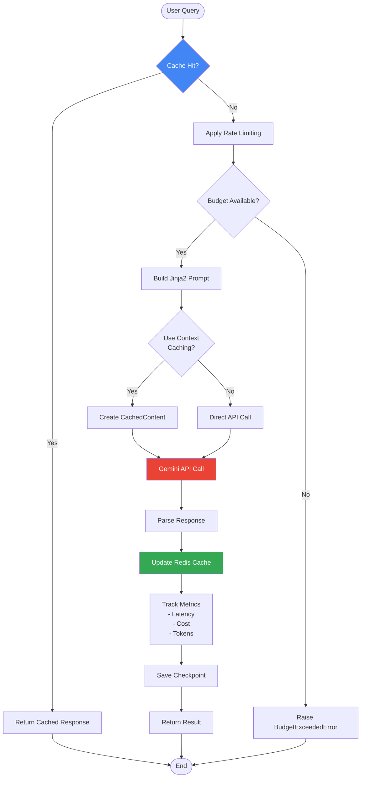

# 데이터 플로우 다이어그램

```mermaid
flowchart TD
    Start([User Query]) --> CheckCache{Cache Hit?}
    
    CheckCache -->|Yes| ReturnCached[Return Cached Response]
    CheckCache -->|No| RateLimit[Apply Rate Limiting]
    
    RateLimit --> CheckBudget{Budget Available?}
    CheckBudget -->|No| BudgetError[Raise BudgetExceededError]
    CheckBudget -->|Yes| BuildPrompt[Build Jinja2 Prompt]
    
    BuildPrompt --> ContextCache{Use Context<br/>Caching?}
    ContextCache -->|Yes| CachedContent[Create CachedContent]
    ContextCache -->|No| DirectAPI[Direct API Call]
    
    CachedContent --> APICall[Gemini API Call]
    DirectAPI --> APICall
    
    APICall --> ParseResponse[Parse Response]
    ParseResponse --> UpdateCache[Update Redis Cache]
    UpdateCache --> TrackMetrics[Track Metrics<br/>- Latency<br/>- Cost<br/>- Tokens]
    
    TrackMetrics --> SaveCheckpoint[Save Checkpoint]
    SaveCheckpoint --> ReturnResult[Return Result]
    
    ReturnCached --> End([End])
    ReturnResult --> End
    BudgetError --> End
    
    style CheckCache fill:#4285f4,color:#fff
    style APICall fill:#ea4335,color:#fff
    style UpdateCache fill:#34a853,color:#fff
```
