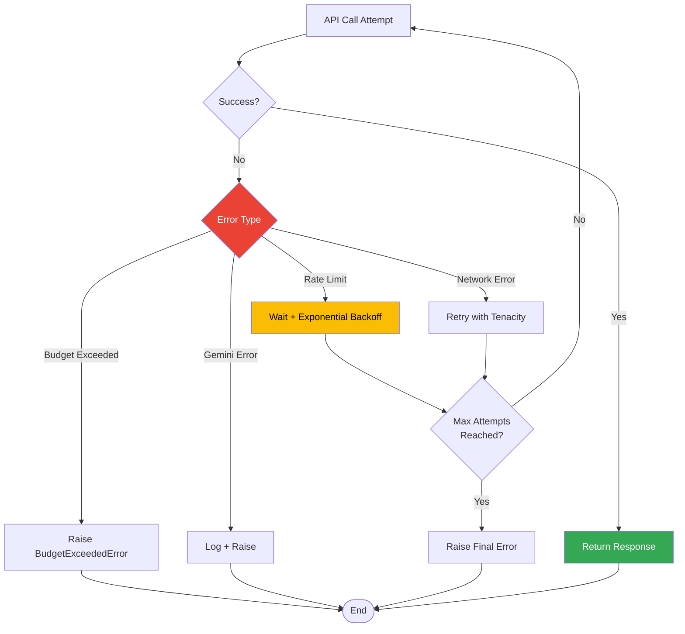

# 에러 핸들링 플로우

```mermaid
flowchart TD
    APICall[API Call Attempt] --> Success{Success?}
    
    Success -->|Yes| Return[Return Response]
    Success -->|No| ErrorType{Error Type}
    
    ErrorType -->|Rate Limit| WaitRetry[Wait + Exponential Backoff]
    ErrorType -->|Budget Exceeded| BudgetError[Raise BudgetExceededError]
    ErrorType -->|Network Error| NetworkRetry[Retry with Tenacity]
    ErrorType -->|Gemini Error| ParseError[Log + Raise]
    
    WaitRetry --> CheckAttempts{Max Attempts<br/>Reached?}
    NetworkRetry --> CheckAttempts
    
    CheckAttempts -->|No| APICall
    CheckAttempts -->|Yes| FinalError[Raise Final Error]
    
    BudgetError --> End([End])
    ParseError --> End
    FinalError --> End
    Return --> End
    
    style ErrorType fill:#ea4335,color:#fff
    style Return fill:#34a853,color:#fff
    style WaitRetry fill:#fbbc04,color:#000
```
