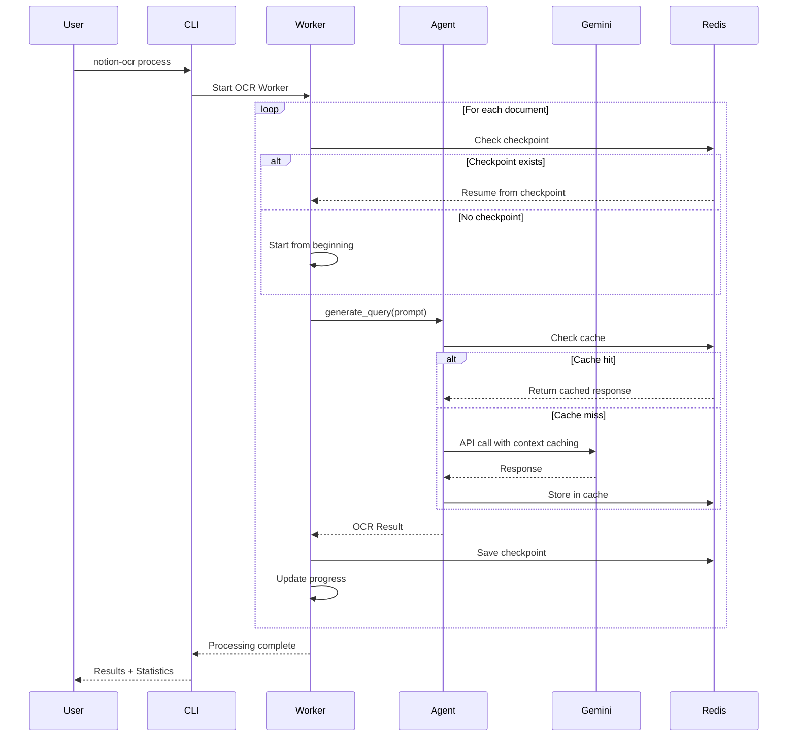

# OCR 처리 워크플로우

```mermaid
sequenceDiagram
    participant User
    participant CLI
    participant Worker
    participant Agent
    participant Gemini
    participant Redis
    
    User->>CLI: notion-ocr process
    CLI->>Worker: Start OCR Worker
    
    loop For each document
        Worker->>Redis: Check checkpoint
        alt Checkpoint exists
            Redis-->>Worker: Resume from checkpoint
        else No checkpoint
            Worker->>Worker: Start from beginning
        end
        
        Worker->>Agent: generate_query(prompt)
        Agent->>Redis: Check cache
        
        alt Cache hit
            Redis-->>Agent: Return cached response
        else Cache miss
            Agent->>Gemini: API call with context caching
            Gemini-->>Agent: Response
            Agent->>Redis: Store in cache
        end
        
        Agent-->>Worker: OCR Result
        Worker->>Redis: Save checkpoint
        Worker->>Worker: Update progress
    end
    
    Worker-->>CLI: Processing complete
    CLI-->>User: Results + Statistics
```
