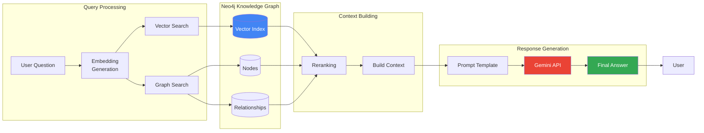

# RAG 시스템 구조

```mermaid
graph LR
    subgraph "Query Processing"
        Q[User Question] --> Embed[Embedding<br/>Generation]
        Embed --> VectorSearch[Vector Search]
        Embed --> GraphSearch[Graph Search]
    end
    
    subgraph "Neo4j Knowledge Graph"
        VectorSearch --> VectorIndex[(Vector Index)]
        GraphSearch --> Nodes[(Nodes)]
        GraphSearch --> Relationships[(Relationships)]
    end
    
    subgraph "Context Building"
        VectorIndex --> Rerank[Reranking]
        Nodes --> Rerank
        Relationships --> Rerank
        Rerank --> Context[Build Context]
    end
    
    subgraph "Response Generation"
        Context --> Prompt[Prompt Template]
        Prompt --> LLM[Gemini API]
        LLM --> Answer[Final Answer]
    end
    
    Answer --> User[User]
    
    style VectorIndex fill:#4285f4,color:#fff
    style LLM fill:#ea4335,color:#fff
    style Answer fill:#34a853,color:#fff
```
