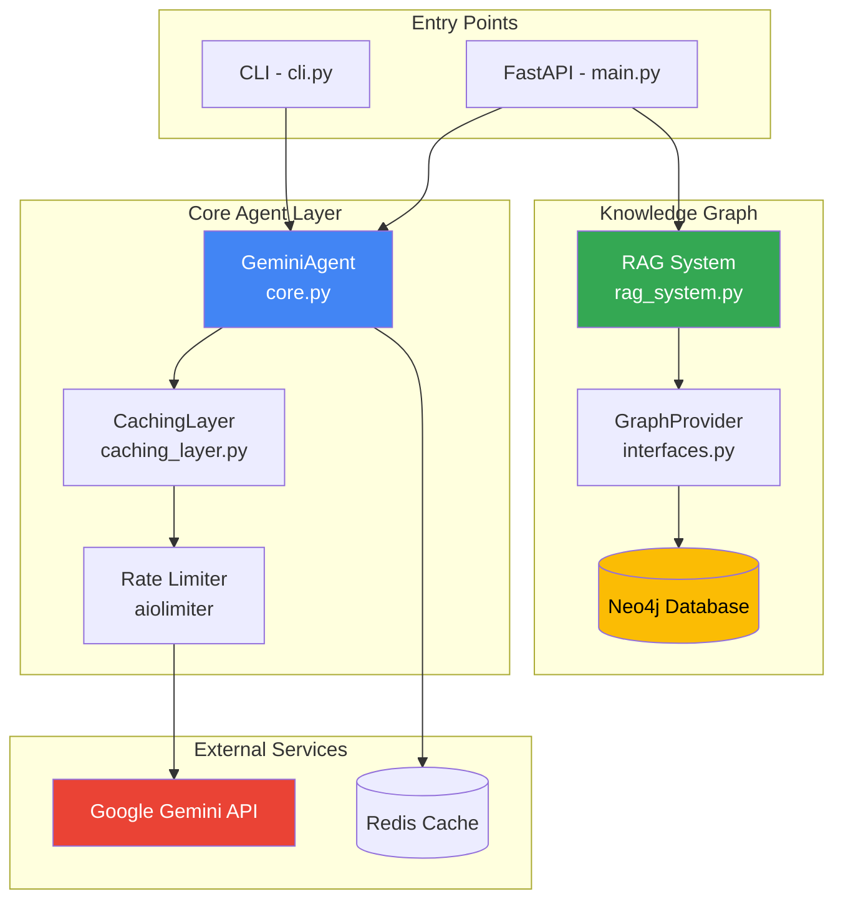

# 전체 시스템 아키텍처

```mermaid
graph TB
    subgraph "Entry Points"
        CLI[CLI - cli.py]
        API[FastAPI - main.py]
    end
    
    subgraph "Core Agent Layer"
        Agent[GeminiAgent<br/>core.py]
        Cache[CachingLayer<br/>caching_layer.py]
        RateLimit[Rate Limiter<br/>aiolimiter]
    end
    
    subgraph "Knowledge Graph"
        RAG[RAG System<br/>rag_system.py]
        Neo4j[(Neo4j Database)]
        GraphProvider[GraphProvider<br/>interfaces.py]
    end
    
    subgraph "External Services"
        Gemini[Google Gemini API]
        Redis[(Redis Cache)]
    end
    
    CLI --> Agent
    API --> Agent
    API --> RAG
    
    Agent --> Cache
    Cache --> RateLimit
    RateLimit --> Gemini
    
    Agent --> Redis
    
    RAG --> GraphProvider
    GraphProvider --> Neo4j
    
    style Agent fill:#4285f4,color:#fff
    style RAG fill:#34a853,color:#fff
    style Gemini fill:#ea4335,color:#fff
    style Neo4j fill:#fbbc04,color:#000
```
